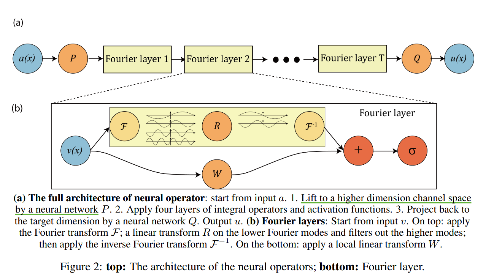

> 记录一些算子神经网络求解PDE的笔记.
[TOC]

最简单的神经网络函数 $f(X, \theta) = Wx + b, \theta = \{W, b\}$ 只能拟合线性函数.

## 1.传统数值算法

- 有限差分法(2维 possion 方程)：数值差分代替微分
- 有限元法：构造基函数
软件
- Firedrake
- Dolfin_adjoint


- 传统数值算法需要构造**剖分**，若求解维数太高会导致维度灾难.
- **维度灾难**： d 维空间若每个维度打 n 个网格点，那么需要 $d^n$ 个网格点.


PINN：


## 2.Fourier Neural Operator for Parametric Partial Differential Equations(FNO)  
Zongyi Li (2020)
[1] Fourier Neural Operator with Learned Deformations for PDEs on General Geometries

- 作者博客：https://zongyi-li.github.io/blog/2020/fourier-pde (这里简要介绍了Fourier neural operator)
- 作者代码仓库：https://github.com/neuraloperator/neuraloperator
- 作者代码仓库 (更新)：https://github.com/li-Pingan/fourier-neural-operator
- L. Lu 在关于他的文章 DeepONet & FNO 对比 的代码仓库：https://github.com/lu-group/deeponet-fno
(主要参考这个)
- **保姆级教程**：https://xiaoyuxie.top/Sci-ML-Book/FNO/FNO-1D/FNO-1D.html
只需在 kaggle 上修改路径即可
```python
dataset_path = '/kaggle/input/fnodatasets/burgers_data_R10.mat'
```

按照上述博客，首先 `pip install neuraloperator`

- 参考知乎 https://zhuanlan.zhihu.com/p/643434159 , 发现原作者的代码仓库时发现他提供的数据集(谷歌硬盘上)并不完整
- 偏微分方程求解器（FNO,DeepOnet)等解读：https://zhuanlan.zhihu.com/p/585290158

b站code：50:40

算子学习可以被视为一个图像到图像的问题。傅里叶层可以被看作是卷积层的替代品.

N-S 方程


经典的神经网络关注有限维空间之间的映射，而神经算子学习的是函数空间之间的映射. 神经算子的优点：
- 泛化性：求解一类带参数的PDE.
- 快速性：将时间从 18 h 缩减到 2 分半.

缺点：
- 需要输入数值解进行学习，只能做特殊类型的方程.
- 如果 a(x), f(x) 的性质太好，直接用数值解 + 插值就够了；不一定能克服性质不好的函数.
- 分析误差时，无法像传统方法一样估计收敛阶数，只能做对比和数值解的相对误差.
- FFT要求在均匀网格上采样.



由于要学习一类 a(x), 首先利用 Gauss 随机随机场采样 $\{ a_j \}_{j = 1}^{N}$，对应得到 $\{ u_j \}_{j = 1}^{N}.$
损失函数
$$
\min_{\theta \in \Theta} \mathbb{E}_{a \sim \mu}[C(G(a, \theta), G^{\dagger}(a))]
$$
- 先输入 a(x), 利用线性变换 P 映射到一个更高维度的特征空间 (类似于 CNN 中的“通道”概念)
- Wv(x) 的作用：类似残差连接，保留⼀些⾼频信息.
- 滤波后线性变换 R 的作用：？


```python

class FNO1d(nn.Module):
    def __init__(self, modes, width):
        """
        1D Fourier Neural Operator model.

        Args:
            modes (int): Number of spectral modes.
            width (int): Number of input channel.
        """
        super(FNO1d, self).__init__()
        self.modes1 = modes
        self.width = width 
        self.fc0 = nn.Linear(2, self.width) # input channel is 2: (a(x), x) MeshgridTensor + initial condition

        self.conv0 = SpectralConv1d(self.width, self.width, self.modes1)
        self.conv1 = SpectralConv1d(self.width, self.width, self.modes1)
        self.conv2 = SpectralConv1d(self.width, self.width, self.modes1)
        self.conv3 = SpectralConv1d(self.width, self.width, self.modes1)
        
        self.w0 = nn.Conv1d(self.width, self.width, 1)
        self.w1 = nn.Conv1d(self.width, self.width, 1)
        self.w2 = nn.Conv1d(self.width, self.width, 1)
        self.w3 = nn.Conv1d(self.width, self.width, 1)

        self.fc1 = nn.Linear(self.width, 128)
        self.fc2 = nn.Linear(128, 1)

    def forward(self, x):
        # stage 1: lift the channel from 2 to self.width = 64
        x = self.fc0(x)         # [Batch, Nx, C] -> [Batch, Nx, Width], eg. [20, 128, 2] -> [20, 128, 64]
        x = x.permute(0, 2, 1)  # [Batch, C, Nx], eg. [20, 64, 128]

        # stage 2: integral operators u' = (W + K)(u).
        # W is the linear transformation; K is the spectral convolution kernel.
        x1 = self.conv0(x)      # [Batch, C, Nx], eg. [20, 64, 128]
        x2 = self.w0(x)         # [Batch, C, Nx], eg. [20, 64, 128]
        x = x1 + x2
        x = F.relu(x)           # [Batch, C, Nx], eg. [20, 64, 128]

        x1 = self.conv1(x)
        x2 = self.w1(x)
        x = x1 + x2
        x = F.relu(x)           # [Batch, C, Nx], eg. [20, 64, 128]

        x1 = self.conv2(x)
        x2 = self.w2(x)
        x = x1 + x2
        x = F.relu(x)           # [Batch, C, Nx], eg. [20, 64, 128]

        x1 = self.conv3(x)
        x2 = self.w3(x)
        x = x1 + x2             # [Batch, C, Nx], eg. [20, 64, 128]

        # stage 3: put the channel back to 1
        x = x.permute(0, 2, 1)  # [Batch, Nx, C], eg. [20, 128, 64]
        x = self.fc1(x)         # [Batch, Nx, C] -> [Batch, Nx, 128], eg. [20, 128, 64] -> [20, 128, 128]
        x = F.relu(x)
        x = self.fc2(x)         # [Batch, Nx, C] -> [Batch, Nx, 1], eg. [20, 128, 128] -> [20, 128, 1]
        
        # since there are only one output
        x = x.squeeze(-1)       # [Batch, Nx, 1] -> [Batch, Nx], eg. [20, 128, 1] -> [20, 128]
        
        return x

    # out = model(x).reshape(batch_size, nt, nx) # 隐式触发了 forward(x), 这是因为 Module 类内部定义了 __call__ 方法

```

### 随机采样方法


## 3.DeepONet: Learning nonlinear operators for identifying differential equations based on the universal approximation theorem of operators

- 神经网络算子(1)——DeepONet介绍：https://zhuanlan.zhihu.com/p/492307258

[5] T. Chen and H. Chen. Universal approximation to nonlinear operators by neural networks with arbitrary activation functions and its application to dynamical systems. IEEE Transactions on Neural Networks, 6(4):911–917, 1995.

Deep Operator Net 的目标是为了逼近算子
$G: V \to C(K_2) $是一个非线性连续算子，其中 $V \subset C(K_1) $

分为 trunk, branch 两部分

记 $\xi_{i}^k = \sigma(\begin{bmatrix} \xi_{i1}^k, \xi_{i2}^k, \cdots, \xi_{in}^k \end{bmatrix}
\begin{bmatrix} u(x_1) \\ u(x_2) \\ \vdots \\ u(x_n) \end{bmatrix}+ \theta_{i}^{k} ) $


$$\xi_{i}^k = \sigma(\begin{bmatrix} \xi_{i1}^k, \xi_{i2}^k, \cdots, \xi_{in}^k \end{bmatrix}
\begin{bmatrix} u(x_1) \\ u(x_2) \\ \vdots \\ u(x_n) \end{bmatrix}+ \theta_{i}^{k} ) $$


## 4.INTERPOLATION, APPROXIMATION, AND CONTROLLABILITY OF DEEP NEURAL NETWORKS

- ResNet 
- 监督学习的性质：UAP, UIP

深度学习架构满足affine invariance, 


## 5.Teaching Robots to Build Simulations of Themselves

- 机器人通过观察他们自己的运动（类比于人类照镜子），学会了模拟自身、预测在不同任务的空间运动.
- 自监督模型


### 5.1. Abstract
**学习算法**使机器人从 2D 视频来建模自己的 3D 形态结构、运动学、运动控制用于任务规划.


### 多种任务
#### 3D 形态学预测
实际机器人臂上**绿色**的覆盖部分表示我们模型的预测

神经辐射场(Neural Radiance Fields)

#### 运动规划
- 3D 螺旋轨迹
- 无碰撞运动规划


### Methods
#### Free-Form Kinematic Self-model
包含三层深度神经网络：
coordinates encoder, kinematic encoder, predictive module

$L(\theta) = \Vert p_{ee}(\theta) - X_{target} \Vert ^2 $


核心问题：
要做什么任务，模型构建 (不能复现就算了)
选择**哪个**神经网络，输入参数是什么，效果怎么样，数据集是什么
数据集怎么样？

encoder, decoder 架构, basisonet 架构, 学习基
$$
u_1(t) = \sum_{n=1}^{N}\gamma_n \exp(\mu_n t) + \cdots 
$$


主要问题：分配 expert 到 gpu, on-line learning

CSR matrix，dims = 1(行和列求和的速度差异 100 倍)
PDHG, PDHCG