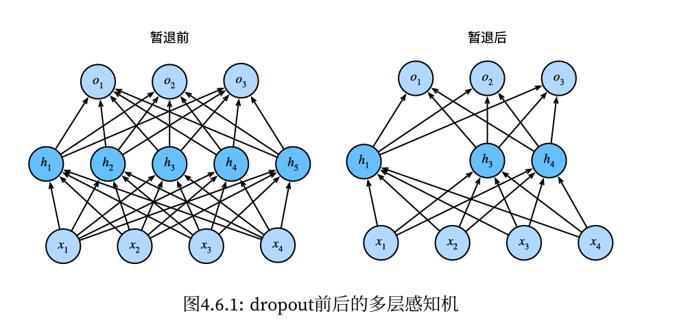
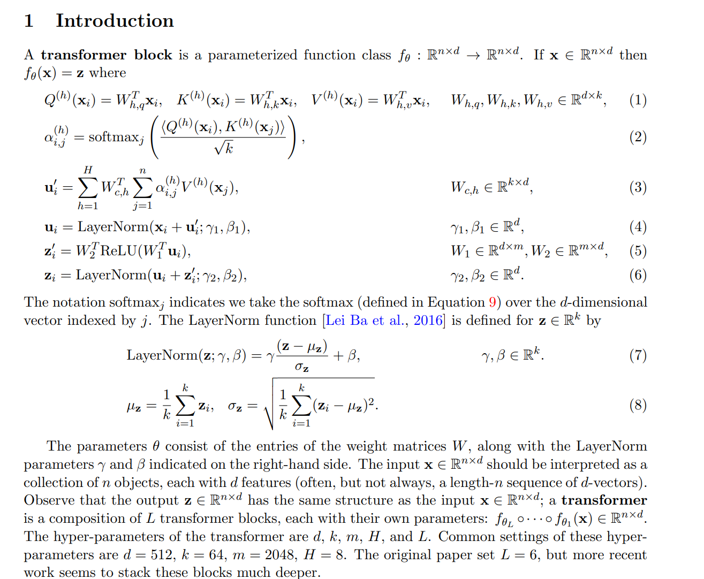

# 欢迎使用Markdown

> 记录一些machine learning和算子神经网络的笔记.
[TOC]

- 让计算机从数据中学习，然后自行做预测和决定.
- 分类：从数据中提取特征，利用算法，实现最大化正确分类

**监督学习**：

**神经网络**：
- 分为输入层、隐藏层、输出层
    - **输入**层线性组合**加权**，再用**激活**函数控制范围，**隐藏**层不断重复上述操作。

1. 全连接/前馈神经网络   
2. 循环神经网络 (CNN)
3. 卷积神经网络 (RNN)

- 1的问题：权重矩阵参数过多
- 改进方法：采用卷积神经网络降低参数

2017年，NLP领域OpenAI提出的Transformer取代了CNN和RNN？(Maybe)

- 离散化为有限维：需要函数空间的信息，非光滑的需要密集格点，不可行.
**算子神经网络**：神经网络逼近无穷微空间之间的非线性算子，有三大学习方向：
1. 构建逼近算子的神经网络，
已有的工作：1995 Chen 双输入分支，Lu 的算子模型DeepONet
2. 核积分变换，核函数方法

**万有逼近定理**：有限维可

package: pytorch


``` python
import torch
x = torch.arange(5)

```
``` python
def f(x):
    return 3 * x ** 2 - 4 * x

def numerical_limit(f, x, h):
    return (f(x + h) - f(x)) / h

h = 0.1
for i in range(5):
    print(f'h={h:.5f}, numerical limit={numerical_limit(f, 1, h):.5f}')
    h *= .1
```

## Chapter 2. 求导

### 17.线性代数


```python

# 矩阵转置
A.T

```


### 17.自动求导

(梯度) 设$f(x) : \mathbb{R}^n \rightarrow \mathbb{R}, x$是 n 维列向量, $\nabla f$是 n 维行向量.


例1. $x, w \in \mathbb{R}^n, y \in \mathbb{R}, z = ( \langle x, w \rangle - y)^2, $求 $\frac{\partial z}{\partial w}.$

由于$\frac{\partial x^{\mathrm{T}} w}{\partial w} = x^{\mathrm{T}}, $

$$
\frac{\partial z}{\partial w} = 2( \langle x, w \rangle - y) \frac{\partial \langle x, w \rangle}{\partial w} = 2( \langle x, w \rangle - y) x^{\mathrm{T}}.
$$

例2. $X \in \mathbb{R}^{m\times n}, w \in \mathbb{R}^n, y \in \mathbb{R}^m, z = \Vert Xw - y \Vert ^2, $求 $\frac{\partial z}{\partial w}.$

由于$\frac{\partial b^{\mathrm{T}} b}{\partial b} = b^{\mathrm{T}} + b^{\mathrm{T}} = 2b^{\mathrm{T}},$

$$
\frac{\partial z}{\partial w} = \frac{\partial \Vert b \Vert ^2}{\partial b} \frac{\partial a - y}{\partial a} \frac{\partial Xw}{\partial w} = 2b^{\mathrm{T}} \times I \times X = 2(Xw - y)^{\mathrm{T}} X 
$$

- 自动求导：有别于符号求导(Mathematica)，数值求导
- 两种模式：正向累积
$$
\frac{\partial y}{\partial x} = \frac{\partial y}{\partial u_n}\left( \frac{\partial y }{\partial u_{n-1}}\left( \cdots \left( \frac{\partial u_2 }{ \partial u_1 } \frac{\partial u_1}{ \partial x} \right)  \right)  \right) 
$$


反向传递
$$\frac{\partial y}{\partial x} = \left( \left(  \left(  \frac{\partial y}{\partial u_n}\frac{\partial u_n}{\partial u_{n-1}} \right) \cdots  \right) \frac{\partial u_2}{\partial u_1}  \right) \frac{\partial u_1}{\partial x} $$


## Chapter 3. 线性神经网络

### 19.线性回归
- 线性回归是机器学习最基础的模型，可看作单层神经网络.
标签 (label)：预测的目标 (如房屋的价格 x)
特征 (feature)：预测依据的自变量 (如面积和房龄 y)


简化模型
- 假设1：影响房价的关键元素：卧室个数、卫生间个数、居住面积，记为$x_1, x_2, x_3.$
- 假设2：成交价是关键元素的加权和
$$
y = w_1 x_1 + w_2 x_2 + w_3 x_3 + b.
$$

向量版本 $y =  \langle w, x \rangle + b.$

假设 $y$ 是真实值， $\hat{y}$ 是估计值，
$$
l (y, \hat{y}) = \frac{1}{2} (y - \hat{y})^{2}
$$

这个叫做平方损失.

假设有 n 个样本，记
$$
X = \begin{bmatrix} x_1, x_2, \cdots, x_n \end{bmatrix}^{\mathrm{T}}, y = \begin{bmatrix} y_1, y_2, \cdots, y_n \end{bmatrix}^{\mathrm{T}}
$$

- 训练损失
$$
l(X, y, w, b) = \frac{1}{2n} \sum_{i = 1}^{n}(y_i - \langle w, x_i \rangle - b)^{2} = \frac{1}{2n} \Vert y - Xw -b \Vert^{2}
$$

- 最小化损失来学习参数
$$
w^*, b^* = \argmin_{w,b} l(X, y, w, b).
$$

不妨记 $X = [X, 1], w = [w, b]^{\mathrm{T}}$
$$
l(X, y, w) = \frac{1}{2n} \Vert y - Xw \Vert^{2}, \  \frac{\partial }{\partial w} l(X, y ,w) = \frac{1}{n} (y - Xw)^{\mathrm{T}} X
$$

因此显示解
$$
w^* = (X^{\mathrm{T}} X) ^{-1} Xy.
$$


```python
def synthetic_data(w, b, num_examples):  #@save
    """生成y=Xw+b+噪声"""

    # 生成 num_examples * len(w) 的张量, X 的元素服从正态分布
    X = torch.normal(0, 1, (num_examples, len(w))) 
    y = torch.matmul(X, w) + b # 矩阵乘法
    y += torch.normal(0, 0.01, y.shape)
    return X, y.reshape((-1, 1)) # 若干行, 1 列

>>> true_w = torch.tensor([2, -3.4]) 
>>> print(true_w.shape)
torch.Size([2])

import torch.nn as nn
class Linear(nn.module):
  def __init__(self, input, output, device=None, dtype=None):
    super.__init__()
    self.input = input
    self.output = output
    self.device = device
    self.dtype = dtype
    self.W = nn.Parameter(torch.empty(output, input), device=device, dtype=dtype)
    nn.init.trunc_normal_(self.W, )

```


### 20.基础优化算法

 **梯度下降法**
选取初始值 $w_0,$
$$w_t = w_{t - 1} - \eta \frac{\partial l}{\partial w_{t - 1}}.  $$

其中 $l$ 是损失函数, $\eta$ 是学习率 (步长的超参数, 不能太大 or 太小)


 **小批量随机梯度下降法**
在整个训练集上算梯度太贵
- 可以随机采样 b 个样本 $i_1, i_2, \ldots , i_b$ 来近似损失
$$
\frac{1}{b} \sum_{i \in I_b} l(x_i, y_i, w)
$$
- b 是批量大小 (另一个重要的**超参数**)

- 总结
    - 梯度下降通过不断沿着反梯度方向更新参数求解.
    - 小批量随机梯度下降是深度学习默认的求解算法
    - 两个重要的**超参数**是批量大小、学习率


### 24.Softmax回归
Softmax回归是分类问题.

- 回归估计一个**连续**值，分类预测**离散**类别

分类问题数据集：
- **MNIST**：手写数字识别(10类)；
- **ImageNet**：自然物体分类(1000类)


|   回归   |  分类   |
| :--- | ---:|
|    单连续数值输出    |   通常多个输出(类别个数)    |
|    自然区间 $\mathbb{R}$    |   输出 i 是预测为第 i 类的置信度    |
|    损失 = (预测值 - 真实值)$^2$    |       |


从回归到分类 - 均方损失

- 对类别进行一位有效编码
$ y = [y_1, y_2, \ldots , y_n]^{\mathrm{T}}, y = \delta_y.$
- 使用均方损失训练
- 最大值 $\hat{y} = \argmax_i o_i$

希望正确类别的置信度足够大

- 输出匹配概率（非负，和为 1）
$$
\hat{y} = \operatorname{softmax}(o),
\hat{y_i} = \frac{\exp(o_i)}{\sum_k \exp(o_k)}
$$

- 读取数据时间至少要比训练时间来得快

```python
num_inputs = 784
num_outputs = 10

W = torch.normal(0, 0.01, size=(num_inputs, num_outputs), requires_grad=True)
b = torch.zeros(num_outputs, requires_grad=True)
```


### 25.损失函数
- L2 Loss: $l(y, y') = \frac{1}{2} (y - y') ^{2}$，离原点越远，梯度越大
- L1 Loss: $l(y, y') =  \left\vert y - y' \right\vert $，梯度为常数，离原点越远，权重更新不大(更稳定)，但原点不可导
- Huber's Robust Loss:
$$
l(y, y') = \begin{cases} \left\vert y - y' \right\vert - \frac{1}{2}, \text{if} \left\vert y - y' \right\vert > 1 &  \\ \frac{1}{2} (y-y')^{2}, \text{otherwise} &  \end{cases}
$$


### 32.感知机
- 给定输入 $x, $ 权重 $w,$ 和偏移 $b,$
$$
o = \sigma (\langle w, x \rangle + b), \sigma (x) = \begin{cases} 1, & \text{if} \ x > 0 \\-1 , & \text{otherwise} \end{cases}
$$

- 感知机是二分类，线性回归输出实数，Softmax回归输出概率 (多分类).

- 训练感知机 (无随机)

```
# 伪代码
initialize w = 0 and b = 0
repeat
    if y_i[<w, x_i> + b] <= 0 then
        w <- w + y_i x_i and b <- b + y_i
    end if
until all classified correctly
```

等价于使用批量大小为 1 的**梯度下降**，并使用如下损失函数
$l(y, x, w) = \max(0, -y\langle w, x \rangle)$

**收敛定理**
数据在半径 r 内，余量 $\rho$ 分类两类 (有 $\rho$ 距离)，保证在 $\frac{r^{2} + 1}{\rho^{2}}$ 步后收敛.

**缺点**
感知机不能拟合 XOR 函数，它只能产生线性分割面. (导致1969年第一次 AI 寒冬)


### 32.多层感知机

- **超参数**：隐藏层层数、每层隐藏层的大小

**单隐藏层 - 单分类**
- 输入 $x \in \mathbb{R}^{n},$ 
- 隐藏层 $W_1 \in \mathbb{R}^{m\times n}, b_1 \in \mathbb{R}^{m}$
- 输出层 $w_2 \in \mathbb{R}^{m}, b_2 \in \mathbb{R}$

$$
\begin{aligned}
h &= \sigma(W_1 x + b) \\ o &= w_2^{\mathrm{T}}h + b_2
\end{aligned}
$$

- 需要非线性的激活函数 $\sigma$ 原因：否则输出就是线性变换.
- 相当于在 softmax 回归中加了一层**隐藏层**.

**Sigmoid 激活函数**
投影到 (0, 1)，对 $\sigma(x) = \begin{cases} 1, & \text{if} \ x > 0 \\ 0, & \text{otherwise} \end{cases}$ 函数进行磨光
$$ \operatorname{sigmoid} (x) = \frac{1}{1 + \exp(-x)}.$$

**Tanh 激活函数**
投影到 (-1, 1)，
$$
\tanh(x) = \frac{1 - \exp(-2x)}{ 1 + \exp(-2x)}.
$$

**ReLU 激活函数**
rectified linear unit (算的快，不需要指数运算)
$$
\operatorname{ReLU} (x) = \max(x, 0).
$$

**多类分类**
$$
y_1, y_2, \ldots , y_k = \operatorname{softmax}(o_1, o_2, \ldots , o_k)
$$


### 37.模型选择
- 训练误差：模型在训练数据上的误差
- 泛化误差 (更关心)：模型在新数据上的误差

数据分成三份：训练集、测试集、验证集 (validation set)

- 验证数据集：用来评估模型好坏的数据集
  - **验证**数据集和**训练**数据集一定不能混在一起！


- 测试数据集：只用一次的数据集 (不能用来调超参数)，例如：
    - 未来的考试


**K 折交叉验证**
- 没有足够多数据使用 (常态)
- 算法：
  - 将训练数据分割成 k 块
  - 使用第 i 块作为验证数据集，其余作为训练数据集
  - 算 k 个验证数据集误差的**平均** (常见 k = 5 或 10, 更大更小都行)

### 38.过拟合和欠拟合

|    模型容量\数据  |  简单   |  复杂 |
| :--- | ------- |     ------:|
|    低    |     正常  | 欠拟合 |
|    高    |   过拟合  |  正常  |

**模型容量**
- 定义：拟合各种函数的**能力**
- 低容量模型难以拟合训练数据
- 高容量模型可以记住**所有**训练数据


核心任务：**泛化**误差尽可能小，(泛化误差 - 训练误差) 尽可能小


**估计模型容量**

- 难以在**不同**种类算法之间比较 (例如树模型和神经网络)
- 给定模型种类，有两个主要因素：参数个数、参数值选择范围

**VC维**
- 对于分类模型，VC dim = 最大数据集的大小，都存在一个模型对他进行完美分类

数据复杂度
- 样本个数、多样性


‌机器学习中的通道数：数据数组中的维度数量，用于存储和处理多个特征，例如，灰度图像有1个通道，RGB图像有3个通道‌.

**前向**传播：按顺序 (从输入层到输出层) 计算和存储神经网络每层的结果，目的是通过已有的权重和偏置，计算出**预测结果**.
**反向**传播：计算神经网络参数梯度的方法，目的是为了**更新参数**.


### 41.权重衰退
- 目标
$$
\min l(w, b) \quad subject \ to \quad \Vert w \Vert^{2} \leq \theta
$$
- 处理过拟合的方法：通过限制参数值的选择范围来控制模型容量.
$$
\min l(w, b) + \frac{\lambda}{2} \Vert w \Vert^{2}
$$
- 超参数 $\lambda$ 控制了正则项的重要程度.
$$
w_{t+1} = (1 - \eta \lambda) w_t - \eta \frac{\partial l(w_t, b_t)}{\partial w_t}
$$

- 通常 $\eta \lambda < 1$ 叫做权重衰退.


### 44.丢弃法
对 $x$ 加入**噪音**得到 $x'$, 希望 $E[x'] = x.$
- 丢弃法对每个元素扰动，将输出项随机置0来控制模型复杂度
$x_i' = \begin{cases} 0, & \text{with probablity} \  p, \\ \frac{x_i}{1-p}, & \text{otherwise} \end{cases}$



- 正则项只在训练中使用：影响模型参数的更新
- 丢弃概率是控制模型复杂度的超参数(p = 0.5, 0.9, 0.1)

### 53.层与块


## Chapter 6. 卷积神经网络

### 63.卷积
1200w 像素图片 $\to $ 3600w 元素，若 100 个隐藏层，有 63 亿个参数

两个原则
- 平移不变性
- 局部性


## Chapter 9. 现代循环神经网络
### 175.编码器-解码器架构
编码器：特征提取


### 181.注意力机制
- 人类根据随意线索和**不随意线索**选择注意点
- 卷积、全连接、池化层指考虑不随意线索
- 注意力机制则显示的考虑随意线索
  - 随意线索被称为 query
  - 每个输入是 value 和不随意线索 key 的对
  - 

注意力汇聚公式：$f(x) = \sum_{i = 1} ^ n \alpha (x, x_i) y_i$
其中 $x$ 是查询，$(x_i, y_i)$是键值对.

$$
f(q, (k_1, v_1), \ldots , (k_m, v_m)) = \sum_{i= 1}^m \alpha(q, k_i)v_i \in \mathbb{R}^{v}
$$

$$
\alpha(q, k_i) = \operatorname{softmax}(a(q, k_i)) = \frac{\exp(a(q, k_i))}{\sum_{j = 1}^m \exp(a(q, k_j))} \in \mathbb{R} 
$$

其中 $a(q, k_i)$ 是注意力分数.
**Additive Attention**
- 可学参数：$W_k \in \mathbb{R}^{h\times k}, W_q \in \mathbb{R}^{h\times q}, v \in \mathbb{R}^h$
$$
a(k, q) = v^T \tanh(W_kk + W_q q)
$$


**Scaled Dot-Product Attention**
- 若 query 和 key 同样长度 $q, k_i \in \mathbb{R}^d$
$$
a(q, k_i) =\langle q, k_i \rangle / \sqrt{d}
$$
- 向量化版本
  - $Q \in \mathbb{R}^{n \times d}, K \in \mathbb{R}^{m\times d}, V \in \mathbb{R}^{m\times v}$
  - 注意力分数：$a(Q, K) = QK^T / \sqrt{d} \in \mathbb{R}^{n\times m}$
  - 注意力池化：$f = \operatorname{softmax}(a(Q, K))V \in \mathbb{R}^{n\times v}$

### 183.自注意力机制


**sinusoidal position representations**





绝对位置编码：让 $p_i$变成可学习的参数，学习 $p \in \mathbb{R}^{d\times n}, p_i$ 是矩阵的列向量.
局限性：不能输入长度超过 n 的.

为什么使用multi-heads: 不同头学会的不同，如指代关系、语法结构、因果关系等等.


## CS336 Language Model from Scratch
### 1.Overview, tokenization
**Overview of the course**
-   basics()
-    systems()
-    scaling_laws()
-    data()
-    alignment()


Data processing -> Tokenization -> Training (Parallelism) -> Inference -> Alignment

**Tokenization**
Tokenizers convert between strings and sequences of integers (tokens)
- Byte-Pair Encoding tokenizer (BPE)


**Architecture Variants:**
- Activation functions: SwiGLU function
- Positional encodings: RoPE
- Normalization: LayerNorm
- Placement of normalization: pre-norm versus post-norm (归一化层提前)
- MLP: dense, MoE
- Attention: full, sliding window
- 

**Training**

**Inference**
Goal: generate tokens given a prompt


**Scaling law**

**Alignment**


### 2.PyTorch, resource accounting

**爱森斯坦求和约定**
```python
# Old way:
  x = torch.ones(2, 2, 1, 3)
# New (einops) way:
  x: Float[torch.Tensor, "batch seq heads hidden"] = torch.ones(2, 2, 1, 3)

def compl_mul2d(self, input, weights):
  # (batch, in_channel, x,y ), (in_channel, out_channel, x,y) -> (batch, out_channel, x,y)
  return torch.einsum("bixy,ioxy->boxy", input, weights)

# Define two tensors:
  x: Float[torch.Tensor, "batch seq1 hidden"] = torch.ones(2, 3, 4)  # @inspect x
  y: Float[torch.Tensor, "batch seq2 hidden"] = torch.ones(2, 3, 4)  # @inspect y
# Old way:
  z = x @ y.transpose(-2, -1)  # batch, sequence, sequence  @inspect z
# New (einops) way:
  z = einsum(x, y, "batch seq1 hidden, batch seq2 hidden -> batch seq1 seq2")  # @inspect z

  x: Float[torch.Tensor, "batch seq hidden"] = torch.ones(2, 3, 4)
# Old way:
  y = x.mean(dim=-1)
# New (einops) way:
  y = reduce(x, "... hidden -> ...", "sum")
```

B * D 矩阵和 D * K 矩阵相乘，actual_num_flops = 2 * B * D * K (crude estimate)

Model_flops_utilization (MFU) >= 0.5 is quite good. 
原因：忽略了通信开销，只是浮点计算.

FLOPS/s depends on hardware(H100 >> A100) and data type(bfloat16 >> float32).
### 3.Architectures, hyperparameters

- Transformer 变体


### 4.Mixture of experts 架构
FFN layer: 
### 5.Intro of GPUs

Information that goes across blocks needs to be written to **global memory**.


### 9.Scaling laws


### 15.RLHF / Alignment
post-training:

GPT-3 经过大量预训练，但不是一个有用的系统.
ChatGPT 遵循多个指令.
goal: 对语言模型更严格、更好的控制.

1.收集行为数据，训练模型完成这些事情.
2.如何利用

论文：InstructGPT

Supervised Fine-Tuning


## ex7
``` python
input print(end1 + end2, end=' ')
print(end3)
output we a
# 以空格结尾，没有换行
```

## ex16
```python
target = open(filename, 'w')
print("Something")
target.truncate
target.write(line1)
target.close() # don't forget it.
```


<!-- | 转义字符  |   功能 | 
| :-------- | ----------:|  
| \t        | ASCII水平制表符(8格)  | 
| \n  | ASCII换行符 | 
| \r  | ASCII回车符(回到开头) | 
| Alt+Z      |   取消换行 | 
| Alt+单击 | 批量选中  |
| Ctrl+Alt+上下 | 选中多行输入 |
| Ctrl+d | 批量选中局部匹配项  |
| Ctrl+u | 取消选中局部匹配项 |
| cat xxx| 读取文件内容|


|   lm   |  $$    |
| :--- | ---:|
|        |       |
\t
.format('xxx') -->


## 强化学习
学习在**不确定性**中做正确的**决策**，让智能体通过与环境的交互学习，以达到某个目标或者最大化累积奖励.

- Agent 包含两块：执行单位，

Environment $\to$ Agent $\to$ Action $A_t$

- (最简单的强化学习模型) Markov 性：**下一个**状态(的概率分布)只由**当前**的状态和动作决定
- 状态 $S_t$ 是 Markov 的，即
$$
p(S_{t+1}| S_t,A_t) = p(S_{t+1} | H_t, A_t)
$$
- 设计算法时，尽量和 Markov 性接近.

### Markov 性
- Markov 性：下一个状态（的概率分布）只由当前状态和动作决定

**(定义)** 称状态过程 $S_t$ 是 Markov 的，当且仅当
$$
P(S_{t + 1} | S_t) = P(S_{t+1} | S_0, S_1, \ldots  ,S_t).
$$

为什么需要 Markov 性：简单
- 按任务分类：单(多)智能体任务，回合制(连续性)任务
- 按算法分类：同策学习(学的策略就是用的策略)/异策学习(下象棋)
回合更新/时序差分更新，基于价值/策略
- 强化学习为了解决无模型学习(现实中属于双驱动)

强化学习**三要素**：MDP、策略、价值函数
- 奖励(reward)：即时结果
- 策略 $\pi$ 是一个条件分布(给定状态)：
$$
\pi(a|s) = P(A_t = a| S_t = s)
$$

- 价值函数(value function) ：长期收益的期望.

常用的数学形式：策略 $\pi$ 下的价值函数 (期望回报)
$$
\begin{aligned}
V^\pi(S_t = s) & = E_\pi [R_t + \gamma R_{t+1} + \gamma R_{t+2} + \cdots | S_t = s ]  \\ & = E_\pi \sum_{k \geq 0 } \gamma^k R_{t+k}
\end{aligned}
$$
- 折扣因子 $\gamma$：数学上的便利，用于衡量长期与短期奖励


- 策略评估 (evaluation)：估计/预测按照给定，即价值函数

历史脉络
- 主线1：源于动物学习心理学的试错法
- 主线2：求解最优控制问题的动态规划方法
- 主线3：时序差分 (temporal difference) - 基于随机逼近的评估算法


AlphaFlod 2：预测蛋白质空间折叠

- 状态 s 到 s' 的概率：
$$
p_{s \rightarrow s' } = p(s' | s)  = P [S_{t + 1} = s' | S_t = s]
$$

- 状态转移矩阵(转移概率矩阵)：
$$
\begin{bmatrix}
    p_{1 \rightarrow 1} & p_{1 \rightarrow 2} & \cdots & p_{1 \rightarrow n} \\
    p_{2 \rightarrow 1} & p_{2 \rightarrow 2} & \cdots & p_{2 \rightarrow n} \\
    \vdots & \vdots & \ddots & \vdots \\
    p_{n \rightarrow 1} & p_{n \rightarrow 2} & \cdots & p_{n \rightarrow n}
\end{bmatrix}
$$


Markov 奖励过程
- ***MRP*** (Markov Reward Process) = MP + Rewards (此时还未出现“动作”，无需决策)
- Markov 性发挥作用：推导 Bellman 方程
$$
\begin{aligned}
V(s) & = E [R_{t+1} + \gamma R_{t+2} + \gamma R_{t+3} + \cdots | S_t = s ]  \\ & = E [R_{t+1} + E[ \gamma R_{t+2} + \gamma R_{t+3} + \cdots | S_{t+1}, S_t ] | S_t = s ] \\ & = E [R_{t+1} + \sum_{s' \in S} P(s' | S_t) E[ \gamma R_{t+2} + \gamma R_{t+3} + \cdots | S_{t+1} = s' ] | S_t = s ] \\ & = E [R_{t+1} + \gamma \sum_{s' \in S} P(s' | S_t) V(s') | S_t = s ]  \\ & 
= E [R_{t+1} | S_t = s ] + \gamma \sum_{s' \in S} P(s' | s) V(s') 
\end{aligned}
$$

记 $R(s) = E [R_{t+1} | S_t = s ],$ 则
$$\begin{bmatrix} V(s_1) \\ V(s_2) \\ \vdots \\ V(s_n) \end{bmatrix} =\begin{bmatrix} R(s_1) \\ R(s_2) \\ \vdots \\ R(s_n) \end{bmatrix} + 
\gamma
\begin{bmatrix}
    p_{1 \rightarrow 1} & p_{1 \rightarrow 2} & \cdots & p_{1 \rightarrow n} \\
    p_{2 \rightarrow 1} & p_{2 \rightarrow 2} & \cdots & p_{2 \rightarrow n} \\
    \vdots & \vdots & \ddots & \vdots \\
    p_{n \rightarrow 1} & p_{n \rightarrow 2} & \cdots & p_{n \rightarrow n}
\end{bmatrix}
\begin{bmatrix} V(s_1) \\ V(s_2) \\ \vdots \\ V(s_n) \end{bmatrix}
$$

简记为 $V = R + \gamma P V,$ 因此
$$
V = (I - \gamma P )^{-1} R
$$

- 确定折扣因子 $\gamma \in [0,1]$


***MDP*** (Markov Decision Process) = MRP + Actions
MDP 五要素：**状态集** $S$，**动作集** $A$，**转移概率**
$$
p(s' | s, a) = P(S_{t+1} = s' | S_t = s, A_t = a)
$$

**奖励机制**
$$
p_r(r | s, a) = P(R_{t+1} = r | S_t = s, A_t = a)
$$

**折扣因子** $\gamma \in [0,1].$

- 策略是一个条件分布
$$
\pi(a | s) = P (A_t = a | S_t = s)
$$

策略固定时，***MDP*** 化为 ***MRP***


- 回报 $G^{\pi}_{t}$：
$$
G^{\pi}_{t} = R^{\pi}_{t+1} + \gamma R^{\pi}_{t+2} + \gamma^{2} (R^{\pi}_{t+2})^{2} + \cdots 
$$
- 策略评估 $V^{\pi}(s) = E[G^{\pi}_{t} | S_t = s].$
- Bellman 方程
$$
V^{\pi}(s) = \sum_a \pi(a | s) \left[ r(s, a) + \gamma \sum_{s' \in S} P(s' | s, a ) V^{\pi} (s') \right].
$$

计算最优策略

唯一最优价值函数：
$$
V^{*} (s) = V^{\pi^{*}} = \max_\pi V^{\pi}(s)
$$

Bellman 方程
$$
V^{*} (s) = \max_\pi \sum_a \pi(a | s) \left[ r(s, a) + \gamma \sum_{s' \in S} P(s' | s, a ) V^{*} (s') \right].
$$


- 强化学习 = 动态规划原理 + 随机逼近算法，随机化确定的方程


奖励机制

-
### 近似动态规划方法
求解 Bellman 方程等价于寻找 Bellman 算子的不动点
$$
V = B(V) = \max_a [R(a) + \gamma P(a) V],
$$


- 基于价值函数的迭代算法 Value Iteration (VI)
$$
V_{k+1} = \tau(V_k) = \max_a [R(a) + \gamma P(a) V_k],
$$


- 基于策略的迭代算法 Policy Iteration (PI)

- 已有策略 $\pi$ 和对应价值函数 $V^{\pi}$
引入 Q 函数：
$$
Q^{\pi}(s, a) = E[R_{t+1} + \gamma V^{\pi} (S_{t+1}) | S_t = s, A_t = a]
$$


值迭代

策略迭代


-
-
-
-
-
-
-
-
-


$$
\begin{cases} \dot{x} = f(t, x u), &  \\ J = h(x(T)) + \int_0^T g(t, x, u) \mathrm{d}t, &  \end{cases}
$$

Hamilton: $H(t,x, p, u) = p  f(t, x, u) + g(t, x, u).$

其中 $p$ 为 Lagrange 乘子.

$$
\begin{cases} \dot{\bar{x}} = \frac{\partial H}{\partial p}(t, \bar{x}, \bar{p}, \bar{u}), &  \\ \dot{\bar{p}} = \frac{\partial H}{\partial x}(t, \bar{x}, \bar{p}, \bar{u}). &  \end{cases}
$$


凸变分：$\frac{\partial H}{\partial u}(t, \bar{x}, \bar{p}, \bar{u}) = 0.$


## HPC 以及 cuda 编程

科学计算的三个步骤：读取数据 -- 计算 -- 写回数据

冯诺依曼架构
- 计算和存储分离

多级存储
- Memory内存(DRAM芯片)


### CUDA Program Model

GPU 低延迟 (三级缓存)
添加 ALU
显存是外围设备，有很大延迟，通过切换 warp 
CUDA core 一直在运行，因此有高吞吐量.

1个GPU有 10496个 CUDA cores.
- FLOPS: 每秒float 操作数 Floating-point Operations per Second
- GFLOPS： $10^9$ FLOPS
- TFLOPS：1000 GLOPS

如 **NVIDIA Ampere A100** GPU有108个SM,每个SM有64个CUDA Cores, 整个GPU总共有6912个CUDA Cores.

GPU 的显存带宽计算公式

计算峰值 = 时钟频率 * cuda core * 2
内存传输带宽 = * 位宽 * 2 / 8

- 在硬件上，**SM** 并不是直接调用 Block 中的 threads. **Warp** 是 SM 调度和执行的基本单位，即 SM 会把 block 划分成多个 wrap，每个 warp 包含 32 个 threads，同一个 warp 内的 threads 执行**相同命令**，但处理**不同数据**.

**warp**: 包含32个线程
**线程**(Thread): CPU 或 GPU 运行的最小计算单元.

**显存**(Video Random Access Memory, VRAM)是 GPU（图形处理单元） 使用的**专用内存**.
**内存**(RAM): 计算机的短期存储器，数据在断电后会丢失.
**带宽**: 单位时间传输的数据量
**显存带宽**：GPU访问显存的速度(如448GB/s)
**延迟**：发送内存请求 $\to $ 实际完成数据移动所需时间.


例. 设计算机延迟为 $\alpha,$ 带宽为 $\beta$
- 移动 N 个长度为 1 的数据需要时间 $N(\alpha + \beta).$
- 移动 1 个长度为 N 的数据需要时间 $ \alpha + N \beta.$


|   software   |  GPU    |  |
| :--------    | ------ | ---:|
|    Thread    |   CUDA core | Threads are executed by cuda core|
|   Thread **Block** |   SM    | Thread blocks are executed by SM |
|    Grid    |   Device    | A kernel is launched as a grid of thread blocks |


triton(用python写内核)


|       |  execution station   | call station |
| :--------  | ------- | -------:|
|   \__device__ |  device   | device  |
|   \__global__  |    device | host    |
|   \__host__    |    host   | host    |

```cpp
gridDim.x // block number of grid
blockDim.x // thread number of block
```


### GPU Optimization

- Memory Optimization (存储优化)


- Instruction Optimization (指令优化)
    - 使用浮点数（Use float if precision allows）
    - 

- Latency Optimization (延迟优化)
\# of blocks > \# of SM
- \# of blocks / \# of SM > 2
    - Multiple blocks can be executed concurrently on SM
    


CPU: 单线程
GPU: 多线程，以warp为调度单位


```cpp
void matrixMulCPU (float* M) 
{

}


__global__ void naiveMatrixMul(float* M, float* N, )
{
    int row = threafIdx.x + blockIdx.x * blockDim.x
    int col = threafIdx.y + blockIdx.y * blockDim.y
    float sum = 0.0f
    for (int i = 0; i < with; i++)
}


```    


```cpp
#include <stdio.h>

void helloCPU()
{
  printf("Hello from the CPU.\n");
}

/*
 * Refactor the `helloGPU` definition to be a kernel
 * that can be launched on the GPU. Update its message
 * to read "Hello from the GPU!"
 */

__global__ void helloGPU()
{
  printf("Hello from the GPU.\n");
}

int main()
{

  helloCPU();

  /*
   * Refactor this call to `helloGPU` so that it launches
   * as a kernel on the GPU.
   */

  helloGPU<<<1, 1>>>();
  /*
   * Add code below to synchronize on the completion of the
   * `helloGPU` kernel completion before continuing the CPU
   * thread.
   */
  cudaDeviceSynchronize(); # halt cpu to wait gpu

}

cudaMallocManaged() 分配数据
```

```cpp
#include <stdio.h>

/*
 * Refactor firstParallel so that it can run on the GPU.
 */

__global__ void firstParallel()
{
  printf("This should be running in parallel.\n");
}

int main()
{
  /*
   * Refactor this call to firstParallel to execute in parallel
   * on the GPU.
   */

  firstParallel<<<5, 5>>>();
  cudaDeviceSynchronize();
  /*
   * Some code is needed below so that the CPU will wait
   * for the GPU kernels to complete before proceeding.
   */

}

!nvcc -arch=sm_70 -o basic-parallel 02-first-parallel/01-basic-parallel.cu -run // 在 Notebook 中运行系统命令
```


```cpp
// Exercise: Use Specific Thread and Block Indices

#include <stdio.h>

__global__ void printSuccessForCorrectExecutionConfiguration()
{

  if(threadIdx.x == 1023 && blockIdx.x == 255)
  {
    printf("Success!\n");
  } 
//   else {
//     printf("Failure. Update the execution configuration as necessary.\n");
//   }
}

int main()
{
  /*
   * Update the execution configuration so that the kernel
   * will print `"Success!"`.
   */

  printSuccessForCorrectExecutionConfiguration<<<256, 1024>>>();
  cudaDeviceSynchronize();
}
```

```cpp
// Accelerating a For Loop with a Single Block of Threads classical error
#include <stdio.h>

/*
 * Refactor `loop` to be a CUDA Kernel. The new kernel should
 * only do the work of 1 iteration of the original loop.
 */

void loop(int N)
{
  for (int i = 0; i < N; ++i)
  {
    printf("This is iteration number %d\n", i);
  }
}

__global__ void loop_gpu()
{
  for (int i = 0; i < N; ++i)
  {
    printf("This is gpu iteration number %d\n", threadIdx.x);
  }
}

int main()
{
  /*
   * When refactoring `loop` to launch as a kernel, be sure
   * to use the execution configuration to control how many
   * "iterations" to perform.
   *
   * For this exercise, only use 1 block of threads.
   */

  int N = 10;
  loop_gpu<<<1, N>>>();
  cudaDeviceSynchronize();
}


// Accelerating a For Loop with Multiple Blocks of Threads

#include <stdio.h>

/*
 * Refactor `loop` to be a CUDA Kernel. The new kernel should
 * only do the work of 1 iteration of the original loop.
 */

void loop(int N)
{
  for (int i = 0; i < N; ++i)
  {
    printf("This is iteration number %d\n", i);
  }
}

__global__ void loop_gpu(){ 

    int time_loop = blockIdx.x;

    printf("This is gpu iteration number %d\n", time_loop);
 }

int main()
{
  /*
   * When refactoring `loop` to launch as a kernel, be sure
   * to use the execution configuration to control how many
   * "iterations" to perform.
   *
   * For this exercise, be sure to use more than 1 block in
   * the execution configuration.
   */

  int N = 10;
  loop(N);
  loop_gpu<<<N, 1>>>();
  cudaDeviceSynchronize();
  
}


```

```cpp
// 指针
>>> int a = 10;
>>> int *p = &a;  // p 是指针，存 a 的地址
>>> printf("%d\n", *p)
10

int N = 10;
size_t size = N * sizeof(int);
int *a;
a = (int *)malloc(size)


// Array Manipulation on both the Host and Device

#include <stdio.h>

/*
 * Initialize array values on the host.
 */

void init(int *a, int N)
{
  int i;
  for (i = 0; i < N; ++i)
  {
    a[i] = i;
  }
}

/*
 * Double elements in parallel on the GPU.
 */

__global__ void doubleElements(int *a, int N)
{
  int i;
  i = blockIdx.x * blockDim.x + threadIdx.x;
  if (i < N)
  {
    a[i] *= 2;
  }
}

/*
 * Check all elements have been doubled on the host.
 */

bool checkElementsAreDoubled(int *a, int N)
{
  int i;
  for (i = 0; i < N; ++i)
  {
    if (a[i] != i*2) return false;
  }
  return true;
}

int main()
{
  int N = 100;
  int *a;

  size_t size = N * sizeof(int);

  /*
   * Refactor this memory allocation to provide a pointer
   * `a` that can be used on both the host and the device.
   */

  a = (int *)malloc(size);

  init(a, N);
  free(a);

  size_t threads_per_block = 10;
  size_t number_of_blocks = 10;

  /*
   * This launch will not work until the pointer `a` is also
   * available to the device.
   */
  cudaMallocManaged(&a, size);

  doubleElements<<<number_of_blocks, threads_per_block>>>(a, N);
  cudaDeviceSynchronize();

  bool areDoubled = checkElementsAreDoubled(a, N);
  printf("All elements were doubled? %s\n", areDoubled ? "TRUE" : "FALSE");

  /*
   * Refactor to free memory that has been allocated to be
   * accessed by both the host and the device.
   */

  cudaFree(a);
}


```


```cpp
// Assume `N` is known
int N = 100000;

// Assume we have a desire to set `threads_per_block` exactly to `256`
size_t threads_per_block = 256;

// Ensure there are at least `N` threads in the grid, but only 1 block's worth extra
size_t number_of_blocks = (N + threads_per_block - 1) / threads_per_block;

some_kernel<<<number_of_blocks, threads_per_block>>>(N);


//////// Accelerating a For Loop with a Mismatched Execution Configuration

#include <stdio.h>

/*
 * Currently, `initializeElementsTo`, if executed in a thread whose
 * `i` is calculated to be greater than `N`, will try to access a value
 * outside the range of `a`.
 *
 * Refactor the kernel defintition to prevent our of range accesses.
 */

__global__ void initializeElementsTo(int initialValue, int *a, int N)
{
  int i = threadIdx.x + blockIdx.x * blockDim.x;
  if (i < N)
  {
    a[i] = initialValue;
  }
}

int main()
{
  /*
   * Do not modify `N`.
   */

  int N = 1000;

  int *a;
  size_t size = N * sizeof(int);

  cudaMallocManaged(&a, size);

  /*
   * Assume we have reason to want the number of threads
   * fixed at `256`: do not modify `threads_per_block`.
   */

  size_t threads_per_block = 256;

  /*
   * Assign a value to `number_of_blocks` that will
   * allow for a working execution configuration given
   * the fixed values for `N` and `threads_per_block`.
   */

  size_t number_of_blocks = (N + threads_per_block - 1)/ threads_per_block;

  int initialValue = 6;

  initializeElementsTo<<<number_of_blocks, threads_per_block>>>(initialValue, a, N);
  cudaDeviceSynchronize();

  /*
   * Check to make sure all values in `a`, were initialized.
   */

  for (int i = 0; i < N; ++i)
  {
    if(a[i] != initialValue)
    {
      printf("FAILURE: target value: %d\t a[%d]: %d\n", initialValue, i, a[i]);
      exit(1);
    }
  }
  printf("SUCCESS!\n");

  cudaFree(a);
}
```


```cpp
  int indexWithinTheGrid = threadIdx.x + blockDim.x * blockIdx.x
  int gridStride = gridDim.x * blockDim.x;

  for (int i = indexWithinTheGrid; i < N; i += gridStride)
  {
    a[i] *= 2
  }

//// Use a Grid-Stride Loop to Manipulate an Array Larger than the Grid
#include <stdio.h>

void init(int *a, int N)
{
  int i;
  for (i = 0; i < N; ++i)
  {
    a[i] = i;
  }
}

/*
 * In the current application, `N` is larger than the grid.
 * Refactor this kernel to use a grid-stride loop in order that
 * each parallel thread work on more than one element of the array.
 */

__global__ void doubleElements(int *a, int N)
{
  int i;
  int indexWithinTheGrid = blockIdx.x * blockDim.x + threadIdx.x;
  int gridStride = gridDim.x * blockDim.x;
  for (i = indexWithinTheGrid; i < N; i += gridStride)
  {
    a[i] *= 2;
  }
}

bool checkElementsAreDoubled(int *a, int N)
{
  int i;
  for (i = 0; i < N; ++i)
  {
    if (a[i] != i*2) return false;
  }
  return true;
}

int main()
{
  /*
   * `N` is greater than the size of the grid (see below).
   */

  int N = 10000;
  int *a;

  size_t size = N * sizeof(int);
  cudaMallocManaged(&a, size);

  init(a, N);

  /*
   * The size of this grid is 256*32 = 8192.
   */

  size_t threads_per_block = 256;
  size_t number_of_blocks = 32;

  doubleElements<<<number_of_blocks, threads_per_block>>>(a, N);
  cudaDeviceSynchronize();

  bool areDoubled = checkElementsAreDoubled(a, N);
  printf("All elements were doubled? %s\n", areDoubled ? "TRUE" : "FALSE");

  cudaFree(a);
}

```

```cpp
////// Homework: Accelerate Vector Addition Application
#include <stdio.h>
#include <assert.h>

inline cudaError_t checkCuda(cudaError_t result)
{
  if (result != cudaSuccess) {
    fprintf(stderr, "CUDA Runtime Error: %s\n", cudaGetErrorString(result));
    assert(result == cudaSuccess);
  }
  return result;
}

__global__ 
void addVectorsInto(float *result, float *a, float *b, int N)
{
  int i = threadIdx.x + blockIdx.x * blockDim.x;
  if (i < N)
  {
    result[i] = a[i] + b[i];
  }
}

void checkElementsAre(float target, float *array, int N)
{
  for(int i = 0; i < N; i++)
  {
    if(array[i] != target)
    {
      printf("FAIL: array[%d] - %0.0f does not equal %0.0f\n", i, array[i], target);
      exit(1);
    }
  }
  printf("SUCCESS! All values added correctly.\n");
}

int main()
{
  const int N = 2<<20;
  size_t size = N * sizeof(float);

  float *a;
  float *b;
  float *c;

  // a = (float *)malloc(size);
  // b = (float *)malloc(size);
  // c = (float *)malloc(size);
  
  cudaMallocManaged(&a, size);
  cudaMallocManaged(&b, size);
  cudaMallocManaged(&c, size);

  initWith(3, a, N);
  initWith(4, b, N);
  initWith(0, c, N);
  
  // free(a);
  // free(b);
  // free(c);
  
  size_t threads_per_block = 256;
  size_t number_of_blocks = (N + threads_per_block - 1)/ threads_per_block;

  addVectorsInto<<<number_of_blocks, threads_per_block>>>(c, a, b, N);
  cudaDeviceSynchronize();
  
  checkElementsAre(7, c, N);

  cudaFree(a);
  cudaFree(b);
  cudaFree(c);

}

/////// Error
#include <stdio.h>

void initWith(float num, float *a, int N)
{
  for(int i = 0; i < N; ++i)
  {
    a[i] = num;
  }
}

__global__ void addVectorsInto(float *result, float *a, float *b, int N)
{
  int i = threadIdx.x + blockIdx.x * blockDim.x;
  if (i < N)
  {
    result[i] = a[i] + b[i];
  }
}

void checkElementsAre(float target, float *array, int N)
{
  for(int i = 0; i < N; i++)
  {
    if(array[i] != target)
    {
      printf("FAIL: array[%d] - %0.0f does not equal %0.0f\n", i, array[i], target);
      exit(1);
    }
  }
  printf("SUCCESS! All values added correctly.\n");
}

int main()
{
  const int N = 2<<20;
  size_t size = N * sizeof(float);

  float *a;
  float *b;
  float *c;

  a = (float *)malloc(size);
  b = (float *)malloc(size);
  c = (float *)malloc(size);

  initWith(3, a, N);
  initWith(4, b, N);
  initWith(0, c, N);
  
  free(a);
  free(b);
  free(c);

  cudaMallocManaged(&a, size);
  cudaMallocManaged(&b, size);
  cudaMallocManaged(&c, size);

  size_t threads_per_block = 256;
  size_t number_of_blocks = (N + threads_per_block - 1)/ threads_per_block;

  addVectorsInto<<<number_of_blocks, threads_per_block>>>(c, a, b, N);

  checkElementsAre(7, c, N);

  cudafree(a);
  cudafree(b);
  cudafree(c);

}


```


```cpp
////// Add Error Handling
#include <stdio.h>

void init(int *a, int N)
{
  int i;
  for (i = 0; i < N; ++i)
  {
    a[i] = i;
  }
}

__global__ 
void doubleElements(int *a, int N)
{

  int idx = blockIdx.x * blockDim.x + threadIdx.x;
  int stride = gridDim.x * blockDim.x;

  for (int i = idx; i < N + stride; i += stride)
  {
    a[i] *= 2;
  }
}

bool checkElementsAreDoubled(int *a, int N)
{
  int i;
  for (i = 0; i < N; ++i)
  {
    if (a[i] != i*2) return false;
  }
  return true;
}

int main()
{
  /*
   * Add error handling to this source code to learn what errors
   * exist, and then correct them. Googling error messages may be
   * of service if actions for resolving them are not clear to you.
   */

  int N = 10000;
  int *a;

  size_t size = N * sizeof(int);
  cudaMallocManaged(&a, size);

  init(a, N);

  size_t threads_per_block = 2048;
  size_t number_of_blocks = 32;

  doubleElements<<<number_of_blocks, threads_per_block>>>(a, N);
  cudaDeviceSynchronize();

  cudaError_t err;
  err = cudaGetLastError();
  if (err != cudaSuccess)
  {
    printf("Error: %s\n", cudaGetErrorString(err));
  }

  bool areDoubled = checkElementsAreDoubled(a, N);
  printf("All elements were doubled? %s\n", areDoubled ? "TRUE" : "FALSE");

  cudaFree(a);
}


```


```cpp
////// Homework: Accelerate 2D Matrix Multiply Application
#include <stdio.h>

#define N  64

__global__ void matrixMulGPU( int * a, int * b, int * c )
{
  /*
   * Build out this kernel.
   */
   int row = threadIdx.y + blockDim.y * blockIdx.y;
   int col = threadIdx.x + blockDim.x * blockIdx.x;
   if (row < N && row < N)
   {
    val = 0; // avoid garbage value
    for( int k = 0; k < N; ++k )
    {
      val += a[row*N + k] * b[k*N + col]
      c[row*N + col] += val;
    }
   }
}

/*
 * This CPU function already works, and will run to create a solution matrix
 * against which to verify your work building out the matrixMulGPU kernel.
 */

void matrixMulCPU( int * a, int * b, int * c )
{
  int val = 0;

  for( int row = 0; row < N; ++row )
    for( int col = 0; col < N; ++col )
    {
      val = 0;
      for ( int k = 0; k < N; ++k )
        val += a[row * N + k] * b[k * N + col];
      c[row * N + col] = val;
    }
}

int main()
{
  int *a, *b, *c_cpu, *c_gpu; // Allocate a solution matrix for both the CPU and the GPU operations

  int size = N * N * sizeof (int); // Number of bytes of an N x N matrix

  // Allocate memory
  cudaMallocManaged (&a, size);
  cudaMallocManaged (&b, size);
  cudaMallocManaged (&c_cpu, size);
  cudaMallocManaged (&c_gpu, size);

  // Initialize memory; create 2D matrices
  for( int row = 0; row < N; ++row )
    for( int col = 0; col < N; ++col )
    {
      a[row*N + col] = row;
      b[row*N + col] = col+2;
      c_cpu[row*N + col] = 0;
      c_gpu[row*N + col] = 0;
    }

  /*
   * Assign `threads_per_block` and `number_of_blocks` 2D values
   * that can be used in matrixMulGPU above.
   */

  dim3 threads_per_block(16, 16); 
  dim3 number_of_blocks(4, 4);

  matrixMulGPU <<< number_of_blocks, threads_per_block >>> ( a, b, c_gpu );

  cudaDeviceSynchronize();

  // Call the CPU version to check our work
  matrixMulCPU( a, b, c_cpu );

  // Compare the two answers to make sure they are equal
  bool error = false;
  for( int row = 0; row < N && !error; ++row )
    for( int col = 0; col < N && !error; ++col )
      if (c_cpu[row * N + col] != c_gpu[row * N + col])
      {
        printf("FOUND ERROR at c[%d][%d]\n", row, col);
        error = true;
        break;
      }
  if (!error)
    printf("Success!\n");

  // Free all our allocated memory
  cudaFree(a); cudaFree(b);
  cudaFree( c_cpu ); cudaFree( c_gpu );
}


```


### CUDA 特性 (老版本)

cuda toolkit


Features (3) : Dynamical Parallelism (动态并行)


Features (4) : Hyper-Queue


因此，如果假设已定义一个名为 `someKernel` 的核函数，则下列情况为真：
- `someKernel<<<a, b>>>` 配置为 a 个block, 每个block有 b 个 thread


cudaMalloc 阻止多流的并行性

异步内存预取

cuda, cudaMemorycopy
显存管理由编程人员维护，在之前

(原始api编程) 

最后的练习：迭代优化加速的SAXPY应用程序

block数 = warp倍数
grid的线程块数 = sm的倍数


延迟优化  满足最少的warp数，使用更多 shareMemory 和 registers

read-only cache
test cache: 提高合并访存程度

充分利用内存访问合并