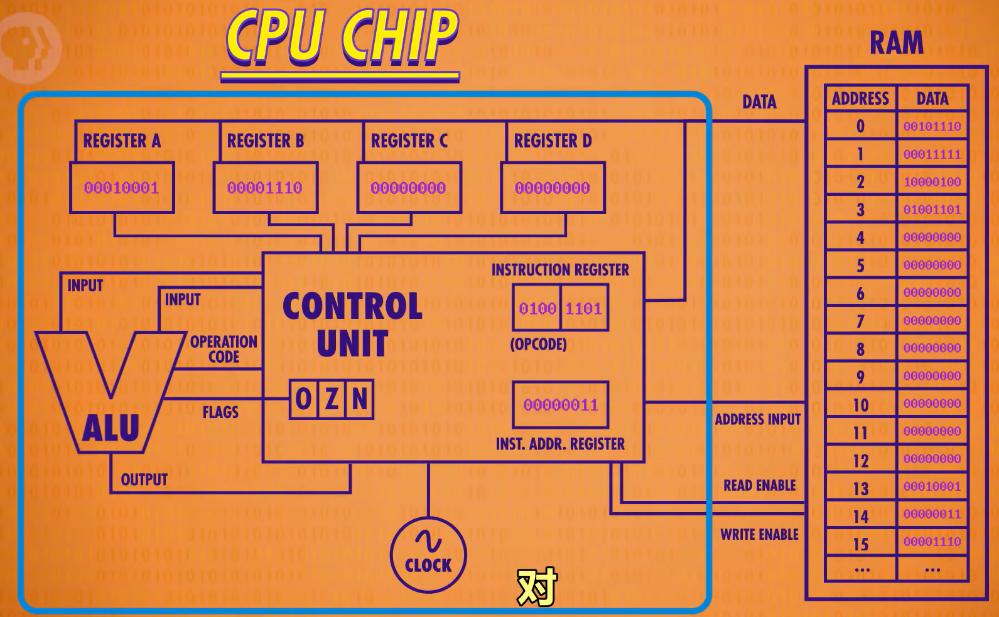

# 欢迎使用Markdown

> 记录一些python的杂例. 目前学习路线是计算机的第0课+笨办法+速成课+cs61a.
[TOC]
## Lec 5. Environments

- Environment diagrams handle the case of higher-order functions.

- Frames contain *bindings*, each of which associates a name with its corresponding value.
- The environment in which the body is evaluated consists of two frames:
    - the local frame that contains formal parameter bindings.
    - the global frame that contains everything else. 
    - Each instance of a function application has its own independent local frame.
- lambda 表达式：作为匿名函数，方便了函数的定义.
- 高阶函数：接受函数作为参数 **或** 返回值是函数的函数. 例子如下：
``` python
def sum(n, term):
    total, k = 0, 1
    while k <= n:
        total, k = total + term(k), k + 1
    return total

def sum_cubes(n):
    return sum(n, lambda x: x**3)


```


## Lec 9. Tree Recursion

``` python
# factorial(!)
def factorial(n):
    fact = 1
    i = 1
    while i <= n:
        fact *= i
        i += 1
    return fact

def factorial(n):
    if n == 0: # base case
        return 1
    else: # recursive case
        return n * factorial(n - 1)

def inverse_cascade(n):
    grow(n)
    print(n)
    shrink(n)
    # if n < 10:
    #     print(n)
    # else:
    #     inv_cas(n % 10)
def f_then_g(f, g, n):
    if n:
        f(n)
        g(n)

grow = lambda n: f_then_g(grow, print, n//10)
shrink = lambda n: f_then_g(print, shrink, n//10) # incredible‌
# shrink = lambda n: f_then_g(lambda n: n // 10, print, n)
```

``` python
# This process is highly repetitive.
def fib(n):
    if n == 0:
        return 0
    elif n == 1:
        return 1
    else:
        return fib(n-2) + f(n-1)

# pseudo code
hanoi(3, 1, 2) # move 3 disks from post 1 to 2
    hanoi(2, 1, 3)
    move_disk(3, 1, 2)
    hanoi(2, 3, 2)

# hanoi_problem has exponential growth.
def move_disk(disk_number, from_peg, to_peg):
    print("Move disk" + str(disk_number) + " from peg " + str(from_peg) + " to peg " + str(to_peg) + ".")
def solve_hanoi(n, start_peg, end_peg):
    if n == 1:
        move_disk(n, start_peg, end_peg)
    else:
        spare_peg = 6 - start_peg - end_peg
        solve_hanoi(n - 1, start_peg, spare_peg)
        move_disk(n, start_peg, end_peg)
        solve_hanoi(n - 1, spare_peg, end_peg)

# Counting Partitions
# partition(6, 4)
# 第一种情况：至少包含一个4, 递归生成 partition(2, 4)
# 第二种情况：不包含4, 递归生成 partition(6, 3)
def count_partitions(n, m):
    if n == 0:
        return 1
    elif n < 0:
        reuturn 0
    elif m == 0:
        return 0
    else:
        with_m = count_partitions(n-m, m)
        without_m = count_partitions(n, m-1)
        return with_m + without_m
```
## Lec 10. Containers
### Lists, Ranges, Strings
- **Lists** is **built-in** data type in python. Lists contain other values.
- **Ranges** 是另一种 sequence type, **不是** lists, 是一列连续的整数.
- Sequence Processing (For statement)
- **Strings** 是Abstraction, 是文本数据的表示 (不关心如何编码)
``` python
# 列表的乘法
>>> [1, 8, 2, 8 ] * 2
[1, 8, 2, 8, 1, 8, 2, 8]

# 列表的负元素
>>> s = [7//3, 5, [4, 0, 1], 2]
>>> s[-1]
2

# 将 range 转化成列表
>>> list(range(4))
[0, 1, 2, 3]

for _ in range(2, 7):
    print(_)
# 输出：2 3 4 5 6, 没有7, 不需要关心_是什么，也就是2到7-1

>>> city = 'Berkeley'
>>> city[3]
'k'
>>> 'here' in "Where's Waldo"
True
``` 
- For statement 为迭代序列而生.
``` python
for <name> in <expression>:
    <suite> # 程序

def count(s, value):
    """Count the number of times that value in sequence s.
    >>> count([1, 2, 1, 2, 1], 1)
    3
    """
    total = 0
    for _ in s:
        if _ == value:
            total += 1
    return total
# 列表才有 [_ for _ in s if _ == value]

# x 就是列表中的元素，这是 for 语句特性(do iteration)
>>> odds = [1, 3, 5, 7, 9]
>>> [x+1 for x in odds]
[2, 4, 6, 8, 10]
``` 

``` python
# Sequence Unpacking
>>> pairs = [[1, 2], [2, 2], [3, 2], [4, 4]]
>>> same_count = 0
>>> for x, y in pairs:
...     if x == y:
...         same_count += 1

# 计算 List L 中的元素之和
def mysum(L):
    sum = 0
    for _ in L:
        sum+= _
    return sum

def mysum(L):
    sum = 0
    if len(L) == 0:
        return 0
    else:
        return L[0] + mysum(L[1:]) # 切片去除第一个元素, 留下从1开始的列表

# 计算 1 + 2 + ... + n, n 为正整数
def sum_rec(n):
    if n == 0:
        return 0
    else:
        return n + sum_rec(n-1)

def sum_iter(n):
    sum = 0
    for _ in range(n+1):
        sum += _
    return sum

# Reversing a list (recursively)
reverse("ward") = reverse("ard") + "w"

def reverse(s):
    if len(s) <= 1:
        return s
    else:
        return reverse(s[1:]) + s[0]
```
```python
# 切片留下前2个元素
>>> [1, 2, 8, 8][:2]
[1, 2]

# 不能直接 nums = new_list，而必须用 nums[:] = new_list.
nums = [1, 2, 3]
ref = nums  # `ref` 现在指向 `nums`
nums = [4, 5, 6]  # nums 现在指向新列表，但 `ref` 仍指向旧列表
print(ref)  # [1, 2, 3] ❌ 没有同步更新
print(nums)  # [4, 5, 6] ✅ `nums` 本身变了
```


介绍一些函数
```python
l1 = list('I love Python')#字符串为可迭代类型
>>> print(l1)
['I', ' ', 'l', 'o', 'v', 'e', ' ', 'P', 'y', 't', 'h', 'o', 'n']

l2 = list([1,'dormitory',[{12,456},'忙']])#列表为可迭代类型
>>> print(l2)
[1, 'dormitory', [{456, 12}, '忙']]

# remove 删掉第一个匹配的元素
t = [5, 6]
t.extend(t)
t.remove(5)
>>> t
[6, 5, 6]

# extend 修改原列表，返回值为 None, + 不修改，返回新列表，节省内存

# pop 删除第 i 个位置的元素, 如果 pop(), 删除最后一个, 修改原列表
hand = ['A', 'K', 'Q', 'J', 10, 9]
>>> hand.pop(1)
'K'
>>> hand
['A', 'Q', 'J', 10, 9]

# append 修改原列表, 返回 None
>>> s = [3, 4, 5]
>>> s.extend([s.append(9), s.append(10)])
>>> s
[3, 4, 5, 9, 10, None, None]
```


## Lec 11. Data Abstract
1. 抽象的数据类型将复合的对象视为一个整体进行操作，是隔开了representation和use的方法.
例如一条直线 f, 
- 使用 `slope(f)` 代替 `f[0]`
- 使用 `y_intercept(f)` 代替 `f[1]`
这样子代码更易读、易修改，无需改动 `f` 的代码
- 有理数
$$
\frac{numerator}{denominator}
$$
- Constructor: rational(n, d): 返回有理数
- Selector: 
    - numer(x): 返回分子
    - denom(x): 返回分母
```python
# 第一层，保证有理数表示的唯一性
from fractions import gcd # python3.9 变为 from math import gcd
def rational(n, d):
    g = gcd(n, d)
    return [n//g, d//g]

# 返回分子
def numer(x):
    return x[0]

# 返回分母
def denom(x):
    return x[1]

# 第二层，利用Constructor和Selector实现有理数的加法
def add_rational(x, y):
    nx, dx = numer(x), denom(x)
    ny, dy = numer(y), denom(y)
    return rational(nx * dy + ny * dx, dx * dy)

def divide_rational(x, y):
    nx, dx = numer(x), denom(x)
    ny, dy = numer(y), denom(y)
    return rational(nx * dy, dx * ny)
# 第三层，调用 add_rational 函数进行运算

# 错误示例，打破抽象屏障
add_rational( [1, 2], [1, 4] )

def divide_rational(x, y):
    return [x[0] * y[1], x[1] * y[0]]
```

- Abstraction Barrirers: 
将有理数看成整个数据、分子和分母；不同层用不同的函数.

- dictionary: 字典具有无序性，是键值对，不能把列表作为键
```python
# 字典
numerals = {'I': 1, 'V': 5, 'X': 10}
>>> numerals['X']
10
>>> 'I' in numerals
True
>>> 1 in numerals.values()
True
>>> 'I' in numerals.keys()
True

>>> {x: x*x for x in range(10)}
{0: 0, 1: 1, 2: 4, 3: 9, 4: 16, 5: 25, 6: 36, 7: 49, 8: 64, 9: 81}

>>> {[1] : 2}
Traceback (most recent call last):
  File "<stdin>", line 1, in <module>
TypeError: unhashable type: 'list'
```


函数式编程的一个很大的好处就是它可以把**不同**的函数中**相似**的过程抽象出来进行**封装**。例如：

假设 `term` 是一个函数，接收 `n` ，返回 `term(n)`，例如可以输入 `term = lambda x : x * x`
```python
# 累乘函数
def product(n, term):
    """
    >>> product(3, lambda x : x)
    6
    >>> product(2, lambda x : x**2)
    5
    """
    product, k = 1, 1
    while k <= n:
        product, k = product * term(k), k + 1
    return product

# 累加函数
def summation(n, term):
    total, k = 0, 1
    while total <= n:
        total, k = total + term(k), k + 1
    return total 
```
注意到 `product` 和 `summation` 结构是相似的. 稍加封装：

```python 
def accumulate(combiner, base, n, term):
    total, k = base, 1
    while k <= n:
        total, k = combiner(total, term(k)), k + 1
    return total

def product(n, term):
    accumulate(add, 0, n, term)

def summation(n, term):
    accumulate(mul, 1, n, term)
```

当然对于上述功能，我们也可以用递归来实现.
``` python
def summation(n, term):
    """Return the sum of the first n terms in the sequence defined by term. Implement using recursion!

    >>> summation(5, lambda x: x * x * x) # 1^3 + 2^3 + 3^3 + 4^3 + 5^3
    225
    >>> summation(9, lambda x: x + 1) # 2 + 3 + 4 + 5 + 6 + 7 + 8 + 9 + 10
    54
    >>> summation(5, lambda x: 2**x) # 2^1 + 2^2 + 2^3 + 2^4 + 2^5
    62
    # Do not use while/for loops!
    """
    if n == 1:
        return term(n)
    return term(n) + summation(n-1, term)
```

## Lec 12. Trees

- Closure Property: combining data values has a closure property if the result of combination can itself be combined using the same method.
    - Lists can contain lists as elements.
    - Create hierarchical structures — structures made up of parts, which themselves are made up of parts, and so on.
- **Slicing**: An operation that you can perform on sequences
- **Trees**
``` python
>>> odds = [3, 5, 7, 9]
>>> odds[1:3]
[5, 7]
>>> odds[:3]
[3, 5, 7]

Sequence Aggregation
>>> sum([2, 3, 4]) # start with 0
9
>>> sum([2, 3, 4], 5) # start with 5
14
>>> sum([[2, 3], [4]], [])
[2, 3, 4]

# 使 lambda x: 7-(x-4)*(x-2) 最大的 x
>>> max(range(10), key = lambda x: 7-(x-4)*(x-2))
3
>>> bool(-1)
True
>>> bool(0)
False
>>> bool('hello')
True
>>> bool('')
False

# all value's bool are True
>>> [x < 5 for x in range(5)]
[True, True, True, True, True]
>>> all([x < 5 for x in range(5)])
True
>>> all(range(5))
False
```


``` python
# Binary Trees (二叉树)
def tree(label, branches=[]):
    for branch in branches:
        assert is_tree(branch), 'branches must be trees'
    return [label] + list(branches) 

def label(tree):
    return tree[0]

def branches(tree):
    return tree[1:]

def is_tree(tree):
    if type(tree) != list or len(tree) < 1:
        return False
    for branch in branches(tree):
        if not is_tree(branch):
            return False
    return True

def is_leaf(tree):
    return not branches(tree)

>>> tree(1)
[1]
>>> t = tree(1, [tree(5, [tree(7)]), tree(6)])
>>> t
[1, [5, [7]], [6]]

def fib_tree(n):
    if n <= 1:
        return tree(n)
    else:
        left, right = fib_tree(n-2), fib_tree(n-1)
        return tree(label(left)+label(right), [left, right])

# Tree Processing Uses Recursion
def count_leaves(t):
    """Count the leaves of tree T."""
    if is_leaf(t):
        return 1
    else:
        return sum([count_leaves(b) for b in branches(t)])

def leaves(tree):
    """Return a list containing the leaf labels of tree.
    >>> leaves(fib_tree(5))
    [1, 0, 1, 0, 1, 1, 0, 1]
    """
    if is_leaf(tree):
        return [label(tree)]
    else:
        return sum([leaves(b) for b in branches(tree)], [])

def increment_leaves(t):
    """Return a tree like t but with leaf labels incremented."""
    if is_leaf(t):
        return tree(label(t) + 1)
    else:
        bs = [increment_leaves(b) for b in branches(t)]
        return tree(label(t), bs)

def increment(t):
    """Return a tree like t but with all labels incremented."""
    return tree(label(t) + 1, [increment(b) for b in branches(t)])

def print_tree(t, indent=0):
    print('  ' * indent + str(label(t)))
    for b in branches(t):
        print_tree(b, indent+1)

>>> print_tree(fib_tree(4))
3
  1
    0
    1
  2
    1
    1
      0
      1
```

``` python
def fact(n):
    if n == 0:
        return 1
    else:
        return n * fact(n - 1)

def fact_times(n, k):
    """Return k * n * (n-1) *...* 1"""
    if n == 0:
        return k
    else:
        return fact_times(n - 1, k * n)

def fact(n):
    return fact_times(n , 1)

def print_sums(t, so_far):
    so_far = so_far + label(t)
    if is_leaf(t):
        print(so_far)
    else:
        for b in branches(t):
            print_sums(b, so_far)

numbers = tree(3, [tree(4), tree(5, [tree(6)])])

haste = tree('h', [tree('a', [tree('s'),
                              tree('t')]),
                   tree('e')])
>>> print_sum(numbers, 0)
7
14
>>> print_sum(haste, '')
has
hat
he

>>> sum([3, 4, 5]) == 0 + 3 + 4 + 5
>>> sum([ [3], [4, 5] ]) == 0 + [3] + [4, 5] # Error
>>> sum([ [3], [4, 5]], []) == [3] + [4, 5]
```
## Lec 13. Binary Numbers
- 2-bit: 00, 01, 10, 11

``` python

```

``` python

```

``` python

```


## Lec 15. Mutable Values

- Object represent information.
    - They consist of data and behavior.
    - Every value is an object.
    - Functions do **one** thing; objects do many **related** things, have multiple methods (like a function).
    - Example: Strings
- ASCII (American Standard Code for Information Interchange) 8 rows and 16 columns.
- Unicode ()
- Objects of **mutable** types: **lists** & **dictionaries**
- Tuples (元组): immutable sequences
    - An immutable sequence may still change if it contains a mutable value as a element


``` python
>>> from datetime import date
>>> date
<class 'datetime.date'>
>>> today = date(2015, 2, 20)

"""
>>> today.year
2015
>>> today.strftime('%A %B %d')
'Friday February 20'
"""

# Methods of strings
>>> s = 'Hello'
>>> s.upper()
'HELLO'
>>> s.lower()
'hello'
>>> s.swapcase()
'hELLO'

>>> a = 'A'
>>> ord(a)
65
>>> hex(ord(a))
'0x41' # 16进制, 4是行, 1是列 in ASCII table

>>> print('\a\a\a') # Bell
```


``` python
# Fisrt example of an object changing state
>>> suits = ['coin', 'string', 'myriad']
>>> original_suits = suits
>>> suits.pop() # 删除列表中最后一个并返回
'myriad'
>>> suits.remove('string')
>>> suits
['coin']
>>> suits.append('cup')
>>> suits.extend(['sword', 'club'])
>>> suits
['coin', 'cup', 'sword', 'club']
>>> suits[2] = 'spade' # 替换列表中2元素
>>> suits[0:2] = ['heart', 'diamond'] # 替换列表中0-1元素
>>> suits
['heart', 'diamond', 'spade', 'club'] 
>>> original_suits
['heart', 'diamond', 'spade', 'club'] 

>>> numerals = {'I': 1, 'V': 5, 'X': 10}
>>> numerals['X'] = 11
>>> numerals['L'] = 50
>>> numerals
{'I': 1, 'V': 5, 'X': 11, 'L': 50}
>>> numerals.pop('X')
11
>>> numerals.get('X')
>>> numerals
{'I': 1, 'V': 5, 'L': 50}

# Mutation can happen within a function call
def mystery(s):
    s.pop()
    s.pop() 
    # s[2:] = []

>>> four = [1, 2, 3, 4]
>>> len(four)
4
>>> mystery(four)
>>> len(four)
2

def another_mystery(s):
    four.pop()
    four.pop() 

>>> four = [1, 2, 3, 4]
>>> len(four)
4
>>> another_mystery()
>>> len(four)
2
```

``` python
# Tuples
>>> (3, 4, 5, 6)
(3, 4, 5, 6)
>>> tuple([3, 4, 5])
(3, 4, 5)
>>> (2,)
(2,)
>>> {(1, 2): 3} # dictionary
{(1, 2): 3}
>>> {(1, [2]): 3}
Traceback (most recent call last):
  File "<stdin>", line 1, in <module>
TypeError: unhashable type: 'list'

# Tuples 里面的列表可变
>>> s = ([1, 2], 3)
>>> s[0] = 4
ERROR
>>> s = ([1, 2], 3)
>>> s[0][0] = 4
>>> s
([4, 2], 3)

# 同一表达式，如果 name 或者 object 改变, value 都有可能改变
# Name
>>> x = 2
>>> x + x
4
>>> x = 3
>>> x + x
6

# Object
>>> x = [1, 2]
>>> x + x
[1, 2, 1, 2]
>>> x.append(3)
>>> x + x
[1, 2, 3, 1, 2, 3]

>>> a = [10]
>>> b = [10]
>>> a == b
True
>>> a is b
False
>>> c = b
>>> c is b
True

def f(s=[]):
    s.append(5)
    return len(s)
>>> f()
1
>>> f()
2

# 关于 list 值变化与否
>>> s = [2, 3]
>>> t = [5, 6]

# ex1. append adds one elemnt (原列表 t 被赋值, 而 s 没有随之变化)
>>> s.append(t)
>>> t = 0
>>> s
[2, 3, [5, 6]]
>>> t
0

# ex.2 extend adds all elements
>>> s.extend(t)
>>> t[1] = 0
>>> s
[2, 3, 5, 6]
>>> t
[5, 0]

# ex.3 addition & slicing create new lists (说明 b[1][1] = t, 因此 b 的元素被赋值, t 随之变化, 从而 a, b 均变化)
>>> a = s + [t]
>>> b = a[1:]
>>> a[1] = 9
>>> b[1][1] = 0 # 使 t[1] = 0
>>> s
[2, 3]
>>> t
[5, 0]
>>> a
[2, 9, [5, 0]]
>>> b
[3, [5, 0]]

# ex.4 list function creates a new list
>>> t = list(s)
>>> s[1] = 0
>>> s
[2, 0]
>>> t
[2, 3]

# ex.5 slice create new lists (说明 t 变化而 s 没有随之变化)
>>> s[0:0] = t
>>> s[3:] = t
>>> t[1] = 0
>>> s
[5, 6, 2, 5, 6]
>>> t
[5, 6]

# slice 替换为本身
>>> t = [1, 2, 3]
>>> t[1:3]
[2, 3]
>>> t[1:3] = [t]
>>> t
[1, [...]] # 自引用
>>> t.extend(t)
[1, [...], 1, [...]]

# slice + append 第二块
>>> t = [[1, 2], [3, 4]]
>>> t[1:2]
[[3, 4]]
>>> t[0].(t[1:2])
>>> t
[[1, 2, [[3, 4]]], [3, 4]]
```


## Lec 16. Mutable Functions

``` python
def make_withdraw(balance):
    def withdraw(amount):
        nonlocal balance
        if amount > balance:
            return 'Insufficient funds'
            balance -= amount
            return balance
        return withdraw


```

``` python

```


## Lec 17. Iterations
- List 和 iterator 是两种不同的数据结构, all iterators are **mutable** objects.
- Dictionary Iteration


``` python
"""
iter(iterable): Return an iterator over the elements of an iterable value.
next(iterable): Return the next element in an iterator.
"""

>>> s = [3, 4, 5]
>>> t = iter(s)
>>> next(t)
3
>>> next(t)
4
>>> s = [[1, 2], 3, 4, 5]
>>> next(s)
Traceback (most recent call last):
  File "<stdin>", line 1, in <module>
TypeError: 'list' object is not an iterator
>>> t = iter(s)
>>> next(t)
[1, 2]
>>> next(t)
3
>>> list(t)  # 指针也会移动
[4, 5]
>>> next(t)
Traceback (most recent call last):
  File "<stdin>", line 1, in <module>
StopIteration

# A dictionary, its keys, its values, and its items are all iterable values.
>>> d = {'one': 1, 'two': 2, 'three': 3}
>>> d['zero'] = 0
>>> k = iter(d.keys()) # or iter(d)
>>> next(k)
'one'
>>> v = iter(d.values())
>>> next(v)
1
>>> i = iter(d.items())
>>> next(i)
('one', 1)

# A dictionary can't change size during iteration, but can change values.
>>> d = {'one': 1, 'two': 2}
>>> k = iter(d)
>>> next(k)
'one'
>>> d['zero'] = 0
>>> next(k)
Traceback (most recent call last):
  File "<stdin>", line 1, in <module>
RuntimeError: dictionary changed size during iteration
>>> d
{'one': 1, 'two': 2, 'zero': 0}
>>> k = iter(d)
>>> next(k)
'one'
>>> next(k)
'two'
>>> d['zero'] = 5
>>> next(k)
'zero'

# Use an iterator in for statement will advance the iterator (just can use once)
>>> r = range(3, 6)
>>> ri = iter(r)
>>> for i in ri:
...     print(i)
...
3
4
5
>>> for i in ri:
...     print(i)
...
```


```python
# Built-in Iterators
map
filter
zip
reversed

>>> bcd = ['b', 'c', 'd']
>>> map(lambda x: x.upper(), bcd) # 生成 iterator
<map object at 0x000001E5DCEE1F40>
>>> m = map(lambda x: x.upper(), bcd)
>>> next(m)
'B'

def double(x):
    print('**', x, '=>', 2*x, '**')
    return 2*x

>>> m = map(double, [3, 5, 7])
>>> next(m) # 调用 next 后, bcd 才有变化 (lazily)
** 3 => 6 **
6

# filter 运行到输出符合 f 的值
>>> m = map(double, range(3, 7))
>>> f = lambda y: y >= 10
>>> t = filter(f, m)
>>> next(t) 
** 3 => 6 **
** 4 => 8 **
** 5 => 10 **
10
>>> list(t)
** 6 => 12 **
[12]
>>> list(t)
[]


# reversed 输出为 iterator
>>> t = [1, 2, 3, 2, 1]
>>> reversed(t) # 输出为 iterator
<list_reverseiterator object at 0x000001E5DCE5B250>
>>> reversed(t) == t
False

# zip(first_iter, second_iter): iterate over co-indexed (x, y) pairs
>>> d = {'a': 1, 'b': 2}
>>> items = iter(d.items())
>>> next(items)
('a', 1)
>>> next(items)
('b', 2)
>>> items = zip(d.keys(), d.values()) # 将 iterators 打包成 tuples
>>> next(items)
('a', 1)
d = {'a': 1, 'b': 2}
items = iter(d.items())
next(items)

items = zip(d.keys(), d.values())

# 将 iter1, iter2, ... 的元素按索引匹配，返回 zip 迭代器(需要 list())。
names = ["Alice", "Bob", "Charlie"]
scores = [85, 90, 95]
combined = list(zip(names, scores))
print(combined)  # [('Alice', 85), ('Bob', 90), ('Charlie', 95)]


# Generators: Special iterator
def plus_minus(x):
    yield x
    yield -x

>>> t = plus_minus(3)
>>> next(t)
3
>>> next(t)
-3

def evens(start, end):
    even = start + (start % 2)
    while even < end:
        yield even # next 函数输出这一行后停止
        even += 2

# 以下两个函数一样
def a_then_b(a, b):
    """
    >>> list(a_then_b([3, 4], [5, 6]))
    [3, 4, 5, 6]
    """
    for x in a:
        yield x
    for x in b:
        yield x

def a_then_b(a, b):
    yield from a
    yield from b

# 一些神奇的 yield from 操作
def countdown(k):
    """
    >>> list(countdown(5))
    [5, 4, 3, 2, 1]
    """ 
    if k > 0:
        yield k
        yield from countdown(k-1) 
        # 错误写法得到 iterator
        # yield countdown(k-1)
    else:
        yield 'Blast off'

def prefixes(s):
    """
    >>> list(prefixes('both'))
    ['b', 'bo', 'bot', 'both']
    """ 
    if s:
        yield from prefixes(s[:-1])
        yield s

def substrings(s):
    """
    >>> list(substrings('tops'))
    ['t', 'to', 'top', 'tops', 'o', 'op', 'ops', 'p', 'ps', 's']
    """ 
    if s:
        yield from prefixes(s)
        yield from substrings(s[1:])

```


## Lec 18. Objects
- Class: combines and abstracts data and functions 类似于草图
- Object: instantiation of a class 类似于具体建筑
    - String 是内置的 class, append 是函数
    - Int 是内置的 class, + 是函数
    `__init__` 方法
- Attribute: object 的 attribute 是与 object 相关的 name-value pair(名称-值对)
    - Instance attribute: 特定于某个对象的属性.


``` python
# 银行账户存取款
class Account:
    interest = 0.02
    def __init__(self, account_holder):
        self.balance = 0
        self.holder = account_holder

    def deposit(self, amount): # method
        self.balance = self.balance + amount
        return self.balance

    def withdraw(self, amount):
        if amount > self.balance:
            return 'Insufficient funds'
        self.balance = self.balance - amount
        return self.balance
tom_account = Account('Tom') # instance
jim_account = Account('Jim') 
tom_account.deposit(100)
>>> tom_account.holder
'Tom'
>>> getattr(tom_account, 'balance')
0

>>> tom_account.interest
0.02
Account.interest = 0.04
>>> tom_account.interest
0.04
tom_account.interest = 0.08 # 不改变Class中的interest值
>>> jim_account.interest
0.04
```

## Lec 19. Inheritance

``` python
# Subclass, 提现支付 1 元
class CheckingAccount(Account):
    "A bank account changes for withdrawls."
    withdraw_fee = 1
    interest = 0.01
    def withdraw(self, amount): # 覆盖base class's attribute
        return Account.withdraw(self, amount + self.withdraw_fee)
        # return Account.withdraw(self, amount + CheckingAccount.withdraw_fee) 无法覆盖值.

# Composition
class Bank:
    """
    >>> bank = Bank()
    >>> john = bank.open_account('John', 10)
    >>> jack = bank.open_account('Jack', 5, CheckingAccount)
    >>> john.interest
    0.02
    >>> jack.interest
    0.01
    >>> bank.pay_interest()
    >>> john.balance
    10.2
    """
    def __init__(self):
        self.accounts = []
    
    # kind = Account 可更改
    def open_account(self, holder, amount, kind = Account):
        account = kind(holer)
        account.deposit(amount)
        self.accounts.append(account)
        return account

    def pay_interest(self):
        for a in self.accounts:
            a.deposit(a.interest * a.amount)

    def too_big_to_fail(self):
        return len(self.accounts) > 1

# 最抽象的一集
class A:
    z = -1
    def f(self, x):
        return B(x-1)

class B(A):
    n = 4
    def __init__(self, y):
        if y:
            self.z = self.f(y)
        else:
            self.z = C(y+1)

class C(B):
    def f(self, x):
        return x

"""
a = A()
b = B(1)
b.n = 5
>>> C(2).n

>>> a.z == C.z

Which evaluates to an integer?
b.z # = B(0)
b.z.z # = C(1)
b.z.z.z # = 1
b.z.z.z.z
"""

class SavingAccount(Account):
    deposit_fee = 2
    def deposit(self, amount):
        return Account.deposit(self, amount - self.deposit_fee)

# Warning: 最好不用multiple inheritance
class AsSeenOnTVAccount(CheckingAccount, Savingaccount):
    def __init__(self, account_holder):
        self.holder = account_holder
        self.balance = 1
```
值得注意的是，如果子类没有 __init__(),它会继承类的 __init__()

## Lec 20. Representation
- String representation: All objects 均有两种 string representations:
    - **str** is legible to humans
    - **repr** is legible to the Python interpreter
- Polymorphic functions: 可以适用于多种不同类型数据的函数，例如 str 和 repr.
    - **str** is a class, not a function.
    - **repr** 调用 0 参数的 method__str__ 作用在参数上.

``` python
>>> from fractions import Fraction
>>> half = Fraction(1, 2)

# repr(object) -> string
>>> repr(half) 
'Fraction(1, 2)'
>>> print(half)
1/2
>>> str(half)
'1/2'

>>> s = "Hello, World"
>>> print(s)
Hello, World
>>> repr(s)
"'Hello, World'"
>>> eval(repr(s))
'Hello, World'
>>> eval(s)
Traceback (most recent call last):
  File "<stdin>", line 1, in <module>
  File "<string>", line 1, in <module>
NameError: name 'Hello' is not defined

>>> half.__str__()
'1/2'
>>> half.__repr__()
'Fraction(1, 2)'

# Skip instance attributes, by looking up the type of the argument that gets the class
def repr(x):
    return type(x).__repr__(x)

def str(x):
    t = type(x)
    if hasattr(t, '__str__'):
        return t.__str__(x)
    else:
        return repr(x)

class Bear:
    """A Bear."""
    
    def __init__(self):
        self.__repr__ = lambda: 'oski'
        self.__str__ = lambda: 'this bear'

    def __repr__(self): # 对应函数 repr
        return 'Bear()'
    
    def __str__(self): # 对应函数 str
        return 'a bear'

oski = Bear
print(oski) # 对应函数 str
print(str(oski))
print(repr(oski))
print(oski.__str__()) # attribute
print(oski.__repr__())

# out
a bear
a bear
Bear()
this bear
oski

```
- Interface: A set of shared messages, 
找 attributes 为了 pass messages
``` python
class Ratio:
    def __init__(self, n, d):
        self.numer = n
        self.denom = d

    def __repr__(self):
        return 'Ratio({0}, {1})'.format(self.numer, self.denom)

    def __str__(self):
        return '{0}/{1}'.format(self.numer, self.denom)

    def __add__(self, other):
        # Type dispatching
        if isinstance(other, int): # 判别 type(other) == int
            n = self.numer + self.denom * other
            d = self.denom
        elif isinstance(other, Ratio):
            n = self.numer * other.denom + self.denom * other.numer
            d = self.denom * other.denom
        # Type coercion
        elif isinstance(other, float):
            return float(self) + other
        g = gcd(n, d)
        return Ratio(n//g, d//g)
    
    __radd__ = __add__
    
    def __float__(self):
        return self.numer/self.denom

def gcd(n, d):
    while n != d:
        n, d = min(n, d), abs(n-d)
    return n


>>> half = Ratio(1, 2)
>>> print(half) # 参考 str
1/2
>>> half # 参考 repr
Ratio(1, 2)

# Special method
__init__
__repr__
__add__
__bool__
__float__

>>> zero, one, two =0, 1, 2
>>> one.__add__(two)
3
>>> zero.__bool__(), one.__bool__()
(False, True)

class Kangaroo:
    def __init__(self):
        self.pounch_contents = []

    def put_in_pouch(self, x):
        if x in self.pounch_contents:
            print("already in pounch")
        else:
            self.pounch_contents.append(x)
            
    def __str__(self):
        if self.pounch_contents == []:
            return "The kangaroo's pounch is empty."
        else:
            return "The kangaroo's pounch contains: " + \
                str(self.pounch_contents)
            # 即"The kangaroo's pounch contains: " + str(self.pounch_contents")

```

## Lec 21. Composition
- Linked Lists: 


``` python
# isinstance( , ): Returns whether an object is an instance of a class.
class Link:
    empty = ()

    def __init__(self, first, rest=empty):
        assert rest is Link.empty or isinstance(rest, Link)
        self.first = first
        self.rest = rest

>>> Link(3, Link(4, Link(5, Link.empty)))
>>> s = Link(3, Link(4, Link(5)))
>>> s.first
3
>>> s.rest.first
4
>>> s.rest.first = 7
>>> s
Link(3, Link(7, Link(5)))
>>> Link(8, s.rest)
Link(8, Link(7, Link(5)))

# 示例
square, odd = lambda x: x * x, lambda x: x % 2 == 1
list(map(square, filter(odd, range(1, 6)))) # [1, 9, 25]
map_link(square, filter_link(odd, range_link(1, 6))) # Link(1, Link(9, Link(25)))

def range_link(start, end):
    """Return a Link containing consecutive integers from start to end.

    >>> range_link(3, 6)
    Link(3, Link(4, Link(5)))
    """
    if start >= end:
        return Link.empty
    else:
        return Link(start, range_link(start + 1, end))

def map_link(f, s):
    """Return a Link that contains f(x) for each x in Link s.
    >>> map_link(square, range_link(3, 6))

    Link(9, Link(16, Link(25)))
    """
    if s is Link.empty:
        return s
    else:
        # s.start = f(s.start)
        return Link(f(s.first), map_link(f, s.rest))

def filter_link(f, s):
    """Return a Link that contains only the elements x of Link s for which f(x) is a true value.

    >>> filter_link(odd, range_link(3, 6))
    Link(3, Link(5))
    """
    if s is Link.empty:
        return s
    filtered_rest = filter_link(f, s.rest)
    if f(s.first):
        return Link(s.first, filtered_rest)
    else:
        return filtered_rest

# 循环链表
>>> s = Link(1, Link(2, Link(3)))
>>> s.first = 5
>>> t = s.rest
>>> t.rest = s
>>> s.first
5
>>> s.rest.rest.rest.rest.rest.first
2

def add(s, v):
    """Add v to an ordered list s with no repeats, returning modified s.

    >>> s = Link(1, Link(3, Link(5)))
    >>> add(s, 0)
    Link(0, Link(1, Link(3, Link(5))))
    >>> add(s, 3)
    Link(0, Link(1, Link(3, Link(5))))
    >>> add(s, 4)
    Link(0, Link(1, Link(3, Link(4, Link(5)))))
    """
    assert s is not Link.empty
    if s.first > v:
        s.first, s.rest = v, Link(s.first, s.rest) 
        # s.first, s.rest = v, s 造成无穷递归
    # elif s.first < v and empty(s.rest): # empty(s.rest)感觉有问题
    elif s.first < v and s.rest is Link.empty:
        s.rest = Link(v)
    elif s.first < v:
        add(s.rest, v)
        # s.rest = add(s.rest, v)
    return s

class Tree:
    """A tree is a label and a list of branches."""
    def __init__(self, label, branches=[]): # branches 还是 list
        self.label = label
        for branch in branches:
            assert isinstance(branch, Tree)
        self.branches = list(branches) # list 有用吗

    def __repr__(self):
        if self.branches:
            branch_str = ', ' + repr(self.branches)
        else:
            branch_str = ''
        return 'Tree({0}{1})'.format(repr(self.label), branch_str)
    
    def __str__(self):
        return '\n'.join(self.indented)

    def indented(self):
        lines = []
        for b in self.branches:
            for line in b.indented():
                lines.append('   '+ line)
        return [str(self.label)] + lines
    
    def is_leaf(self):
        return not self.branches

def fib_tree(n):
    """A Fibonacci tree."""
    if n == 0 or n == 1:
        return Tree(n)
    else:
        left = fib_tree(n-2)
        right = fib_tree(n-1)
        fib_n = left.label + right.label
        return Tree(fib_n, [left, right])

def leaves(t):
    """Return a list of leaf labels in Tree T."""
    if t.is_leaf():
        return [t.label]
    else:
        all_leaves = []
        for b in t.branches:
            all_leaves.extend(leaves(b))
        return all_leaves

def height(t):
    """Return the number of transitions in the longest path in T."""
    if t.is_leaf():
        return 0
    else:
        return 1 + max([height(b) for b in t.branches])

def prune(t, n):
    """Prune all sub-trees whose label is n."""
    t.branches = [b for b in t.branches if b.label != n] # 更新 b in branches
    for b in t.branches:
        prune(b, n) # 修改 b


>>> Tree(1, [3, 4]) # Error, [3, 4] is not tree
>>> t = Tree(1, [Tree(3), Tree(4)])
>>> print(t)
1
    3
    4

>>> print('*'.join(['aa', 'bb', 'c']))
aa*bb*c
```


## Lec 22. Efficiency
- Memoization: 是加快程序运行时间的技术.
``` python
# Fibonacci sequence, O(b^n) exponential time
def fib(n):
    if n == 0 or n == 1:
        return n
    else:
        return fib(n-2) + fib(n-1)

def count(f):
    def counted(n):
        counted.call_count += 1
        return f(n)
    counted.call_count = 0
    return counted

>>> fib = count(fib)
>>> fib(5)
5
>>> fib.call_count
15
>>> fib(5)
5
>>> fib.call_count # 可以累加次数
30
>>> fib(30)
832040
>>> fib.call_count
2692567

# 以空间换运算速度
def memo(f):
    cache = {} # 缓存
    def memoized(n):
        if n not in cache:
            cache[n] = f(n)
        return cache[n]
    return memoized

>>> fib = count(fib) # fib have attribute call_out
>>> counted_fib = fib

>>> fib = memo(fib)
>>> fib = count(fib)
>>> fib(30)
832040
>>> fib.call_count
56
>>> counted_fib.call_count
31
```

- Exponentiation
$$b^n= \begin{cases} 1 & \mathrm{if~}n=0 \\ (b^{\frac{1}{2}n})^2 & \mathrm{if~}n\mathrm{~is~even} \\ b\cdot b^{n-1} & \mathrm{if~}n\mathrm{~is~odd} & \end{cases}$$
- 字典中元素的数量不影响 key 找 value 的时间.(后续课程)
``` python
# O(n) 线性时间
def exp(b, n):
    if n == 0:
        return 1
    else:
        return b * exp(b, n-1)

# O(log n) 时间
def exp_fast(b, n):
    if n == 0:
        return 1
    elif n % 2 == 0:
        return square(exp_fast(b, n//2))
    else:
        return b * exp_fast(b, n-1)

def square(x):
    return x * x

# O(n^2) quadratic time
def overlap(a, b):
    count = 0
    for item in a:
        for other in b:
            if item == other:
                count += 1
    return count
```
- Frames: 
- Space / Memory 是执行时消耗的另一种资源
    - e.g. values, frames

``` python
# Functions as Returned Values
def count_frames(f):
    def counted(n): # 增加开放帧数
        counted.open_count += 1
        if counted.open_count > counted.max_count:
            counted.max_count = counted.open_count
        result = f(n)
        counted.open_count -= 1
        return result
    counted.open_count = 0
    counted.max_count = 0
    return counted

>>> fib = count_frames(fib)
>>> fib(20) # 原先的 fib 被封装成了 count_frames(fib), 返回值一样
6765
>>> fib.open_count
0
>>> fib.max_count # 说明函数用了多少 space
20

# Decorators
>>> def do_twice(original_function):
...     def repeat(x):
...             original_function(x)
...             original_function(x)
...     return repeat

# Printing a value twice
# print_value = do_twice(print_value)
>>> @do_twice
... def print_value(x):
... print x
...
>>> print_value(5)
5
5
```


## Lec 23. Decomposition
- Modular Design: Whole program is broken up into small fairly **independent** parts.
- A design principle: **Isolate** different parts of a program that address different concerns.


``` python
# Restaurant search engine
def search(query, ranking=lambda r: -r.stars):
    results = [r for r in Restaurants.all if query in r.name]
    return sorted(results, key=ranking)

def reviewed_both(r, s):
    # return len([x for x in r.reviewers if x in s.reviewers]) # 二次时间
    return fast_overlap(r.reviewers, s.reviewers) # 线性时间

class Restaurant:
    all = []
    def __init__(self, name, stars, reviewers):
        self.name, self.stars = name, stars
        self.reviewers = reviewers
        all.append(self)

    def similar(self, k, similarity):
        "Return the k most similar restaurants to SELF."
        others = list(Restaurant.all)
        others.remove(self)
        different = lambda r: -similarity(r, self)
        return sorted(others, key= lambda r: -similarity(self, r))[:k]

    def __repr__(self):
        return '<' + self.name + '>'

import json

reviewers_for_restaurant = {}
for line in open('reviews.json')
    r = json.loads(line)
    biz = r['business_id']
    if biz not in reviewer_for_restaurant:
        reviewers_for_restaurant[biz] = [r['user_id']]
    else:
        reviewers_for_restaurant[biz].append(r['user_id'])

for line in open('restaurant.json'):
    r = json.loads(line)
    reviewers = reviewer_for_restaurant[r['business_id']]
    Restaurant(r['name'], r['stars'], sorted(reviewers)) 
    # Restaurant(r['name'], r['stars'], reviewers)

# Restaurant('Thai Delight', 2)
# Restaurant('Thai Basil', 3)
# Restaurant('Top Dog', 5)

while True:
    print('>', end=' ')
    results = search(input().strip())
    for r in results:
        print(r, 'share reviewers with', r.similar(3))

# 双指针
def fast_overlap(s, t):
    """Return the overlap between sorted S and sorted T.

    >>> fast_overlap([3, 4, 6, 7, 9, 10], [1, 3, 5, 7, 8])
    2
    """
    i, j, count = 0, 0, 0
    while i < len(s) and j < len(t):
        if s[i] == t[j]:
            count, i, j = count + 1, i + 1, j + 1
        elif s[i] < t[j]:
            i += 1
        else:
            j += 1
    return count

# Sets: A container type, have arbitrary order
>>> s = {'one', 'two', 'three', 'four', 'four'}
>>> s
{'two', 'four', 'one', 'three'}
>>> len(s)
4
>>> s.union({'one', 'five'})
{'four', 'three', 'five', 'two', 'one'}
>>> s.intersection({'six', 'five', 'four', 'three'})# 不改变 s
{'three', 'four'}
>>> s 
{'two', 'four', 'one', 'three'}
```


## Lec 24. Data Example
- **Instance** attributes are found before **class** attributes; class attributes are **inherited**.
``` python
# Object system
class Worker:
    greeting = 'Sir'
    def __init__(self):
        self.elf = Worker
    def work(self):
        return self.greeting + ', I work'
    def __repr__(self):
        return Bourgeoisie.greeting

class Bourgeoisie(Worker):
    greeting = 'Peon'
    def work(self):
        print(Worker.work(self)) # 不带''
        return 'I gather weath'

jack = Worker()
john = Bourgeoisie()
jack.greeting = 'Maam'

>>> Worker().work()
'Sir, I work'
>>> jack
Peon
>>> jack.work()
'Maam, I work'
>>> john.work
Peon, I work
'I gather wealth'
>>> john.elf.work(john)
'Peon, I work'

# Iterables & Iterators
def min_abs_indices(s):
    """Indices of all elements in a list s have the smallest absolute value.

    >>> min_abs_indices([-4, -3, -2, 3, 2, 4])
    [2, 4]
    >>> min_abs_indices([1, 2, 3, 4, 5])
    [0]
    """
    min_abs = min(map(abs, s))
    return [i for i in range(len(s)) if abs(s[i]) == min_abs]

    # 法2
    # min_abs = min(map(abs, s))
    # f = lambda i: abs(s[i]) == min_abs
    # return list(filter(f, range(len(s))))

    # 法3
    # smallest_list = []
    # for i in range(len(s)):
    #     if abs(s[i]) == min_abs:
    #         smallest_list.append(i)


def largest_adj_sum(s):
    """Largest sum of two adjacent elements in a list s.

    >>> largest_adj_sum([-4, -3, -2, 3, 2, 4])
    6
    >>> largest_adj_sum([-4, 3, -2, -3, 2, -4])
    1
    >>> s = [-4, -3, -2, 3, 2, 4]
    >>> list(zip(s[:-1], s[1:]))
    [(-4, -3), (-3, -2), (-2, 3), (3, 2), (2, 4)]
    """
    return max([s[i] + s[i+1] for i in range(len(s) - 1)])

    # 法2
    # return max([a + b for a, b in zip(s[:-1], s[1:])])

    # 法3
    # result = s[0] + s[1]
    # for i in range(len(s)-1):
    #     if s[i] + s[i+1] > result:
    #         result = s[i] + s[i+1]
    # return result

def digit_dict(s):
    """Map each digit d to the lists of elements in s that end with d.

    >>> digit_dict([5, 8, 13, 21, 34, 55, 89])
    {1: [21], 3: [13], 4: [34], 5: [5, 55], 8: [8], 9: [89]}
    """
    last_digits = [x % 10 for x in s]
    return {d: [x for x in s if x % 10 == d] for d in range(10) if d in last_digits}

    # 法2
    # dic = {}
    # return {i % 10: i for i in s}
    # for i in s:
    #     d = i % 10
    #     dic[d].append(i)
    # return dic

def all_have_an_equal(s):
    """Does every element equal some other element in s?

    >>> all_have_an_equal([-4, -3, -2, 3, 2, 4])
    False
    >>> all_have_an_equal([4, 3, 2, 3, 2, 4])
    True
    >>> s = [4, 3, 2, 3, 2, 4]
    >>> [sum([1 for y in s if y == x]) for x in s]
    [2, 2, 2, 2, 2, 2]
    """
    return min([s.count(x) for x in s]) > 1
    
    # 法1
    # return all([s[i] in s[:i] + s[i+1:] for i in range(len(s))])

    # 法2
    # return min([sum([1 for y in s if y == x]) for x in s]) > 1
    
    # 法3 WRONG
    # sort_list = sorted(s)
    # for i in range(len(s) // 2):
    #     if sort_list[i] == sort_list[i+1]:
    #         sort_list = sort_list[2:]
    #     else:
    #         return False
    # return True

def ordered(s, key=lambda x: x):
    """Is Link s ordered?
    >>> ordered(Link(1, Link(3, Link(4))))
    True
    >>> ordered(Link(1, Link(4, Link(3))))
    False
    >>> ordered(Link(1, Link(-3, Link(4))))
    False
    >>> ordered(Link(1, Link(-3, Link(4))), key=abs)
    True
    """
    if s is Link.empty or s.rest is Link.empty:
        return True
    elif key(s.first) > key(s.rest.first):
        return False
    else:
        return ordered(s.rest)

def merge(s, t):
    """Return a sorted Link with the elements of sorted s & t.

    >>> a = Link(1, Link(5))
    >>> b = Link(1, Link(4))
    >>> merge(a, b)
    Link(1, Link(1, Link(4, Link(5))))
    >>> a
    Link(1, Link(5))
    >>> b
    Link(1, Link(4))
    """
    if s is Link.empty:
        return t
    elif t is Link.empty:
        return s
    elif s.first <= t.first:
        return Link(s.first, merge(s.rest, t))
    else:
        return Link(t.first, merge(s, t.rest))

def merge_in_place(s, t):
    """Return a sorted Link with the elements of sorted s & t.

    >>> a = Link(1, Link(5))
    >>> b = Link(1, Link(4))
    >>> merge_in_place(a, b)
    Link(1, Link(1, Link(4, Link(5))))
    >>> a
    Link(1, Link(1, Link(4, Link(5))))
    >>> b
    Link(1, Link(4))
    """
    if s is Link.empty:
        return t
    elif t is Link.empty:
        return s
    elif s.first <= t.first:
        s.rest = merge_in_place(s.rest, t)
        return s
    else:
        t.rest = merge_in_place(s, t.rest)
        return t
```

## Lec 26. Ethical AI & Data


``` python


```


``` python


```


``` python


```

``` python


```


``` python


```

``` python


```


``` python


```

``` python


```


## Lec 27. Scheme
- Scheme is a dialect of Lisp
- Special Forms: Combination that's not a call expression.
    - **If** expression: (if \<predicate> \<consequent> \<alternative>)
    - **And** and **or**: (and <e_1> ... <e_n>) (or <e_1> ... <e_n>)
    - (define \<symbol> \<expression>)


``` scheme
> (quotient 10 2)
5
> (* 2 2 2)
8
> (zero? (- 2 2))
#t
> (number? 3)
#t
> (integer? 2)
#t
> (define pi 3.14)
> (* pi 2)
6.28

> (define (abs x)
    (if (< x 0)
        (- x)
        x))
> (abs -3)
3

> (define (square x) (* x x))
square
> (define (average x y)
    (/ (+ x y) 2))
average
> (define (sqrt x)
    (define (update guess)
        (if (= (square guess) x)
            guess
            (update (average guess (/ x guess)))))
        (update 1))
sqrt

> ((lambda (x y z) (+ x y (square z))) 1 2 3)
12

> (fd 100); move forward 100
> (rt 90); turning right by 90 degrees
> (bk 100); go backward 100
> (lt 90); turn left

> (define (line) (fd 50))
line
> (define (twice fn) (fn) (fn))
> (define (repeat k fn)
    (fn)
    (if (> k 1) (repeat (- k 1) fn)))
> (repeat 5 (lambda () (fd 50) (rt 144))); Create a star

> (define (tri fn)
    (repeat 3 (lambda () (fn) (lt 120))))
> (tri line); Make regular triangle


> (print
    (cond ((> x 10) 'big)
          ((> x 5)  'medium)
          (else     'small)))

> (if ((> x 10) (begin (print 'big)  (print 'guy)))
      (else    (begin (print 'small) (print 'fry))))

> (define c (let ((a 3)
                  (b (+ 2 2)))
                  (sqrt (+ (* a a) (* b b))))); a and b are not bound down here
```

- Scheme lists like linked lists:
    - cons: Two-argument procedure that creates linked list
    - car: Procedure that turns the first element of a list
    - cdr: Procedure that returns the rest of a list
    - nil: The empty list
- Symbolic Programming
- Scheme Expression is a Scheme List
    - Primitive expressions: 2  3.3  true  +  quotient
    - Combination: (quotient 10 2)  (not true)
``` scheme
> (cons 1 (cons 2 nil))
(1 2)
> (define x (cons 1 (cons 2 nil)))
> x
(1 2)
> (car x)
1
> (cdr x)
(2)

> (define s (cons 1 (cons 2 nil)))
s
> (cons 3 s)
(3 1 2)
> (cons (cons 4 (cons 3 nil)) s)
((4 3) 1 2)

> (cons s (cons s nil))
((1 2) (1 2))
> (null? nil)
#t
> (list 1 2 3 4)
(1 2 3 4)
> (define a 1)
> (list 'a b)
(a 2)
> '(a b c)
(a b c)
> (quote a)
a
> (list 1 a)
Error

> (list 'quotient 10 2); Build a list
(quotient 10 2)
> (eval (list 'quotient 10 2))
5
> (list + 1 2)
(#[+] 1 2)
> (define (fact n)
    (if (= n 0) 1 (* n (fact(- n 1)))))
> (fact 5)
120
> (define (fact-exp n)
    (if (= n 0) 1 (list '* n (fact(- n 1)))))
> (fact-exp 5)
(* 5 (* 4 (* 3 (* 2 (* 1 1)))))

> (define (fib n)
    if (<= n 1) n (+ (fib (- n 2) (fib (- n 1)))))
> (define (fib-exp n)
    if (<= n 1) n (list '+ (fib-exp (- n 2) (fib-exp (- n 1)))))
> (fib 6)
8
> (eval (fib-exp 6))
8

; Quasiquote: `(a b) => (a b)
> (define b 4)
> `(a ,(+ b 1))
(a 5)
> (define (make-add-procedure n) `(lambda (d) (+ d, n)))
> (make-add-procedure 2)
=> lambda (d) (+ d 2)

; Recursion
> (begin
    (define (f x total)
        (if (< x 10)
            (f (+ x 2) (+ total (* x x)))
            total))
        (f 2 0))

> (define (sum-while initial-x condition       add-to-total update-x))
 ;        (sum-while 1         '(< (* x x) 50) 'x           '(+ x 1)))
> (begin
    (define (f x total)
        (if ,condition
            (f ,update-x (+ total ,add-to-total))
            total))
        (f ,initial-x 0))
> (eval (sum-while 2 '(< x 10) '(* x x) '(+ x 2)))
120
```

## Lec 28. Exception
- Python raises an exception whenever an error occurs.
- Exceptions can be handled by the program, preventing the interpreter from halting.
- **Mastering exceptions**: Exceptions are objects.
    - **f** calls **g** and **g** calls **h**, exceptions can shift control from **h** to **f** without waiting for **g** to return.
    (Exception handling tends to be slow.)

- Assert statements
    - assert \<expression>, \<string>

- Raise statements
    - raise \<expression>


```python
# Assert statements
>>> assert False, 'Error'
Traceback (most recent call last):
  File "<stdin>", line 1, in <module>
AssertionError: Error

>>> python -O # Ignore assert statements
>>> __debug__ # Tell whether assertions are enabled or not
False
>>> assert False, 'Error'

# Raise statements
>>> raise TypeError('Bad argument')
TypeError: Bad argument
>>> abs('hello')
TypeError: bad operand type for abs(): 'str'
>>> hello
NameError: name 'hello' is not defined
>>> {}['hello']
KeyError: 'hello'
>>> def f(): f()
...
>>> f()
RecursionError: maximum recursion depth exceeded

# Try statements
try:
    <try suite>
except <exception class> as <name>:
    <except suite>

>>> try:
        x = 1/0
    except ZeroDivisionError as e:
        print('handling a', type(e))
        x = 0
handling a <class 'ZeroDivisionError'>       
>>> x
0

def invert(x):
    y = 1/x
    print('Never printed if x is 0')
    return y

def invert_safe(x):
    try:
        return invert(x)
    except ZeroDivisionError as e:
        print('handled', e)
        return 0
>>> invert_safe(0)
handled division by zero
0
>>> 1/0
ZeroDivisionError: division by zero

>>> try:
...     invert_safe(0)
... except ZeroDivisionError as e:
...     print('handled')
...
handled division by zero
0
>>> inverrrrt_safe(1/0)
NameError: name 'inverrrrt_safe' is not defined

from operator import add, mul, truediv

def divide_all(n, ds):
    try:
        return reduce(truediv, ds, n)
    except ZeroDivisionError:
        return float('inf')

def reduce(f, s, initial):
    """Combine elements of s pairwise using f, starting with initial.
    
    E.g., reduce(mul, [2, 4, 8], 1) is equivalent to mul(mul(mul(1, 2), 4), 8).

    >>> reduce(mul, [2, 4, 8], 1)
    64
    >>> reduce(add, [1, 2, 3, 4], 0)
    10
    """
    for x in s:
        initial = f(initial, x)
    return initial

>>> divide_all(1024, [2, 4, 0, 8])
inf
>>> divide_all(1024, [2, 4, 8])
16.0
```


## Lec 29. Calculater
- **Interpreter**: A program that takes as **input** the code written in a programming language and **executes** that code in order to create the behavior described by the program.
- **Scheme**: Simple and effective programming language, its programming language is powerful, but has few rules.

- **Machine languages**: statements are interpreted by the **hardware** itself.
    - A fixed set of instructions invoke operations implemented by the circuitry of CPU
- **Interpreting**: reading the program and **executing** the behavior.
- **Compiling**: translating it into another language, such as machine language. (.exe)


- **High-level languages**: statements & expressions are interpreted by another program or compilied (translated) into another language.
    - Provide **means** of abstraction such as naming, function definition, and objects
    - **Abstract** away system details to be independent of hardware and OS
___

**Metalinguistic (元语言)  Abstraction**
- A powerful form of abstraction is to define a **new language** that is tailored to a **particular type** of application or problem domain.
    - **Erlang** was designed for concurrent programs. For example, it used to implement chat servers with many simultaneous connections, such as in ATM.
    - The **MediaWiki mark-up language** was designed for generating static web pages.
- A programming language has:
    - **Syntax**: The legal statements and expressions in the language.
    - **Semantics**: The execution/evaluation rule for those statements and expressions.

- To create a new programming language, you **either** need a
    - **Specification**: A document describe the precise syntax and semantics of the language. (Scheme)
    - **Canonical Implemenntation**: An interpreter or compilier for the language. (python)


**Parsing**: Converting **text** into an expression **tree** so that the code can be evaluated according to the rules of the language.
- Scheme code is fundamentally **tree** structured.

**Text** -- Lexical analysis --> **Tokens** -- Syntactic analysis --> **Expression**

**Syntactic Analysis** identifies the hierarchical structure of an expression, which may be nested.

**Base case**: symbols and numbers
**Recursive call**: scheme_read sub-expressions and combine them.

- **Scheme-Syntax Calculator**: include the arithmetic operators of scheme: plus, minus, times and divide, as well as call expressions which can be nested.

**Interactive Interpreters** have Read-Eval-Print-Loop.
- **Print** a prompt.
- **Read** text input from the user.
- **Parse** the text input into an expression.
- **Evaluate** the expression.
- If any errors occur, report those errors, otherwise **print** the value of the expression and repeat.

**Raising Exceptions**
- **Lexical analysis**: the token 2.3.4 raises **ValueError**
- **Syntactic analysis**: An extra ) raises **SyntaxError**
- **Eval**: An empty combination raises **TypeError**
- **Apply**: No arguments to - raises **TypeError**
```python
from ucb import trace, main, interact
from operator import add, sub, mul, truediv
from scheme_reader import Pair, nil, scheme_read, buffer_input

def calc_eval(exp):
    """Evaluate a Calculator expression.

    >>> calc_eval(as_scheme_list('+', 2, as_scheme_list('*', 4, 6)))
    26
    >>> calc_eval(as_scheme_list('+', 2, as_scheme_list('/', 40, 5)))
    10
    """
    if type(exp) in (int, float):
        return simplify(exp)
    elif isinstance(exp, Pair):
        arguments = exp.second.map(calc_eval)
        return simplify(calc_apply(exp.first, arguments))
    else:
        raise TypeError(str(exp) + ' is not a number or call expression')

def calc_apply(operator, args):
    """Apply the named operator to a list of args.

    >>> calc_apply('+', as_scheme_list(1, 2, 3))
    6
    >>> calc_apply('-', as_scheme_list(10, 1, 2, 3))
    4
    >>> calc_apply('-', as_scheme_list(10))
    -10
    >>> calc_apply('*', nil)
    1
    >>> calc_apply('*', as_scheme_list(1, 2, 3, 4, 5))
    120
    >>> calc_apply('/', as_scheme_list(40, 5))
    8.0
    >>> calc_apply('/', as_scheme_list(10))
    0.1
    """
    if not isinstance(operator, str):
        raise TypeError(str(operator) + ' is not a symbol')
    if operator == '+':
        return reduce(add, args, 0)
    elif operator == '-':
        if len(args) == 0:
            raise TypeError(operator + ' requires at least 1 argument')
        elif len(args) == 1:
            return -arg.first
        else:
            return reduce(sub, arg.second, args.first)
    elif operator == '*':
        return reduce(mul, args, 1)
    elif operator == '/':
        if len(args) == 0:
            raise TypeError(operator + ' requires at least 1 argument')
        elif len(args) == 1:
            return 1/arg.first
        else:
            return reduce(truediv, arg.second, args.first)
    else:
        raise TypeError(operator + ' is an unknown operator')


def simplify(value):
    """Return an int if value is an integer, or value otherwise.

    >>> simplify(8.0)
    8
    >>> simplify(2.3)
    2.3
    >>> simplify('+')
    '+'
    """
    if isinstance(value, float) and int(value) == value:
        return int(value)
    return value


def reduce(fn, scheme_list, start):
    """Reduce a recursive list of Pairs using fn and a start value.

    >>> reduce(add, as_scheme_list(1, 2, 3), 0)
    6
    """
    if scheme_list is nil:
        return start
    return reduce(fn, scheme_list.second, fn(start, scheme_list.first))

# *args 允许函数接受任意数量的位置参数
def as_scheme_list(*args):
    """Return a recursive list of Pairs that contains the elements of args.

    >>> as_scheme_list(1, 2, 3)
    Pair(1, Pair(2, Pair(3, nil)))
    """
    if len(args) == 0:
        return nil
    return Pair(args[0], as_scheme_list(*args[1:]))

@main
def read_eval_print_loop():
    """Run a read-eval-print loop for Calculator."""
    while True:
        try:
            src = buffer_input()
            while src.more_on_line:
                expression = scheme_read(src)
                print(calc_eval(expression))
        except (SyntaxError, TypeError, ValueError, ZeroDivisionError) as err:
            print(type(err).__name__ + ':', err)
        except (KeyboardInterrupt, EOFError):  # <Control>-D, etc.
            print('Calculation completed.')
            return
```


## Lec 29. Interpreters

The Structure of an Interpreter
- Eval
- Apply


## Lec 30. Declarative Programming with SQL
Database Management Systems (DBMS)
- **Databases**: A collection of tables and tables are where you put your data. Using structured query language (SQL), which is a declarative language.

- **Tables**: A collection of records, which are rows that have a value for each column.
- **declarative language** such as SQL & Prolog:
    - A "program" is a description of the desired result.
- **imperative language** such as Python & Scheme:
    - A "program" is a description of the computational processes.


- **select** statement creates a new table, either from scratch or by projecting a table.
    - The result of select statement is displayed to the user, but not stored.

analyze, delete, explain

``` sql
SELECT [expression] AS [name], [expression] AS [name]; -- 下一列

SELECT [columns] FROM [table] WHERE [condition] ORDER BY [order];


CREATE TABLE [name] AS [select statement]

CREATE TABLE users (
    id INT AUTO_INCREMENT PRIMARY KEY,
    username VARCHAR(255) NOT NULL,
    password VARCHAR(255) NOT NULL,
    email VARCHAR(255),
    created_at TIMESTAMP DEFAULT CURRENT_TIMESTAMP
);

CREATE TABLE parents AS
    SELECT "abraham" AS parent, "barack" AS child UNION
    SELECT "abraham"          , "clinton"         UNION
    SELECT "delano"           , "herbert";
```
Parents:
| parent  |   child | 
| :-------- | ----------:|  
| abraham | barack |
| abraham | clinton |
| delano | herbert |
``` sql
-- Projecting Tables
SELECT child FROM parents WHERE parent = "abraham";
```

| child | 
| :---- |
| barack|
| clinton |

``` sql
-- Arithmetic in Select Expression
CREATE TABLE lift AS
    SELECT 101 AS chair, 2 AS single, 2 AS couple UNION
    SELECT 102 AS chair, 0 AS single, 3 AS couple UNION
    SELECT 103 AS chair, 4 AS single, 1;

SELECT chair, single + 2 * counple AS total FROM lift;    
```

| child | total |
| :---- | -----:|  
| 101 | 6 |
| 102 | 6 |
| 103 | 6 |

Union together a bunch of **SELECT** statements, these row don't appear in the order that I wrote them in the first, but in an **alphabetical order** according to the word.

``` sql
CREATE TABLE ints AS 
    SELECT "zero" AS word, 0 AS one, 0 AS two, 0 AS four, 0 AS eight UNION
    SELECT "one" AS word, 1 AS one, 0 AS two, 0 AS four, 0 AS eight UNION
    SELECT "two" AS word, 0 AS one, 2 AS two, 0 AS four, 0 AS eight UNION
    SELECT "three" AS word, 1 AS one, 2 AS two, 0 AS four, 0 AS eight UNION
    SELECT "four" AS word, 0 AS one, 0 AS two, 4 AS four, 0 AS eight UNION
    SELECT "five" AS word, 1 AS one, 0 AS two, 4 AS four, 0 AS eight UNION
    SELECT "six" AS word, 0 AS one, 2 AS two, 4 AS four, 0 AS eight UNION
    SELECT "seven" AS word, 1 AS one, 2 AS two, 4 AS four, 0 AS eight UNION
    SELECT "eight" AS word, 0 AS one, 0 AS two, 0 AS four, 8 AS eight UNION
    SELECT "nine" AS word, 1 AS one, 0 AS two, 0 AS four, 8;

SELECT word, one + two + four + eight AS value
FROM ints;

SELECT word FROM ints
WHERE one + two/2 + four/4 + eight/8 = 1;

eight
four
one
two
```


## Lec 32. Tables
Two tables **A & B** are joined by a comma to yield all combos of **a row from A** & **a row from B**.
``` sql
CREATE TABLE dogs AS
    SELECT "abraham" AS name, "long" AS fur UNION
    SELECT "barack"         , "short"       UNION
    SELECT "clinton"        , "long"        UNION
    SELECT "fillmore"       , "curly"       UNION
    SELECT "herbert"        , "curly";

CREATE TABLE parents AS
    SELECT "abraham" AS parent, "barack" AS child UNION
    SELECT "abraham"          , "clinton"         UNION
    ...;

SELECT parent FROM parents, dogs
              WHERE child = name AND fur = "curly";

eisenhower
delano

-- Aliases and Dot Expression
-- Select all pairs of siblings, joining a table with itself
SELECT a.child AS first, b.child AS second
    FROM parents AS a, parents AS b
    WHERE a.parent = b.parent AND a.child = b.child
```
| first | second |
| :---- | -----:|  
| barack | clinton |
| abraham | delano |
| abraham | grover |
| delano | grover |

``` sql
-- Joining Multiple Tables
CREATE TABLE grandparents AS
    SELECT a.parent AS grandog, b.child AS grandpup
            FROM parents AS a, parents AS b
            WHERE a.child = b.parent; 

SELECT grandog FROM grandparents, dogs AS c, dogs AS d
  WHERE c.fur = d.fur AND
        c.name = grandog AND
        d.name = grandpup;

eisenhower
fillmore
```


``` sql
CREATE TABLE cities AS
  SELECT 38 AS latitude, 122 AS longitude, "Berkeley" AS name UNION
  SELECT 42,             71,               "Cambridge"        UNION
  SELECT 45,             93,               "Minneapolis"      UNION
  SELECT 33,            117,               "San Diego"        UNION
  SELECT 26,             80,               "Miami"            UNION
  SELECT 90,              0,               "North Pole";


CREATE TABLE cold AS
  SELECT name FROM cities WHERE latitude >=43;

SELECT name FROM cold
Minneapolis
North powerful

-- Numerical Expressions
CREATE TABLE distances AS
  SELECT a.name AS first, b.name AS second,
         60 * (b.latitude - a.latitude) AS distance
         FROM cities AS a, cities AS b;

SELECT second FROM distances
  WHERE first = "Minneapolis"
  ORDER BY distance;
Miami
San Diego
Berkeley
Cambridge
Minneapolis
North Pole

# String Expressions
SELECT "hello," || " world";
hello, world

CREATE TABLE nouns AS
  SELECT "dog" AS phrase UNION
  SELECT "cat"           UNION
  SELECT "bird";

SELECT subject.pharse || " chased" || object.phrase
  FROM nouns AS subject, nouns AS object
  WHERE subject.phrase <> object.phrase;

bird chased cat
bird chased dog
cat chased bird
cat chased dog
dog chased bird
dog chased cat
```


## Lec 33. Aggregation
An **aggregate function** in the [columns] clause computes a value from a group of **rows**.
``` sql
SELECT [columns] FROM [table] WHERE [expression] ORDER BY [expression];

CREATE TABLE animals AS
  SELECT "dog" AS kind, 4 AS legs, 20 AS weight UNION
  SELECT "cat"        , 4        , 10           UNION
  SELECT "ferret"     , 4        , 10           UNION
  SELECT "parrot"     , 2        , 6            UNION
  SELECT "penguin"    , 2        , 10           UNION
  SELECT "t-rex"      , 2        , 12000;

SELECT MIN(legs), MAX(weight) FROM animals
  WHERE kind <> "t-rex";
2|20

SELECT AVG(legs) FROM animals;
3.0

-- count the number of rows
SELECT COUNT(*) FROM animals;
6

SELECT COUNT(DISTINCT weight) FROM animals;
2

SELECT MAX(weight), kind FROM animals;
12000|t-rex

-- get wrong value
SELECT AVG(Weight), kind FROM animals;
2009.33333333333|t-rex

-- get one of right kinds
SELECT MAX(legs), kind FROM animals;
4|cat


SELECT [columns] FROM [table] GROUP BY [expression] HAVING [expression];

SELECT legs, COUNT(*) FROM animals GROUP BY legs;
2|3
4|3

-- Group by two attributes
SELECT legs, weight FROM animals
  GROUP BY legs, weight;
2|6
2|10
2|12000
4|10
4|20

-- A having clause filters the set of groups that are aggregated
SELECT weight/legs, count(*) FROM animals GROUP BY weight/legs HAVING count(*) > 1;
5|2
2|2

```


``` sql


```


``` sql


```


## Lec . Programs as Data

``` sql


```
## Lec 35. Tail Calls


## Lec 36. Macros
A macros is an operation performed on the source **code** of a program before evaluation.


# CS61A 作业
## Lab 06: OOP
``` python
Q1: Bank Account
# 这段不知道用 append, 不知道加形式参数 self.transaction_count
self.transactions.append(Transaction(self.transaction_count, self.balance, self.balance + amount))

# .append 与 += 不同
lst = [1, 2, 3]
lst.append([4, 5])
print(lst)  # 输出: [1, 2, 3, [4, 5]]  （嵌套列表）
len(lst)  # 输出: 4

lst = [1, 2, 3]
lst += [4, 5]
print(lst)  # [1, 2, 3, 4, 5], 起连接作用.


```

## Project 03: Ants
```python
lst = [1, 1, 2, 2, 3, 3]
for elem in lst:
    if elem % 2 == 0:
        lst.remove(elem)

lst
[1, 1, 2, 3, 3]
```


# 笨办法学python
## ex7
``` python
input print(end1 + end2, end=' ')
print(end3)
output we a
# 以空格结尾，没有换行
```

## ex16
```python
from sys import argv # argv = ['']

target = open(filename, 'w') # into write mode
print("Something")
target.truncate()
target.write(line1)
target.close() # don't forget it.
```

## ex25
```python
numbers = [10, 5, 20, 3, 8]
sorted_numbers = sorted(numbers)
print(sorted_numbers)
``` 
输出结果为：
```python
[3, 5, 8, 10, 20]
```
如果输入是英文，则输出按首字母大小排序
```python
def sort_words(words):
    return sorted(words) # sorted是内置函数
``` 

注意，**sorted()** 其实是内置函数，类似于 **print(), range()**


| 转义字符  |   功能 | 
| :-------- | ----------:|  
| \t        | ASCII水平制表符(8格)  | 
| \n  | ASCII换行符 | 
| \r  | ASCII回车符(回到开头) | 
| Alt+Z      |   取消换行 | 
| Alt+单击 | 批量选中  |
| Ctrl+Alt+上下 | 选中多行输入 |
| Ctrl+d | 批量选中局部匹配项  |
| Ctrl+u | 取消选中局部匹配项 |
| cat xxx| 读取文件内容|
| Ctrl+\ | 分屏 |
| Ctrl + K & Ctrl + 0 | 折叠所有代码块/注释 |
| Ctrl + K & Ctrl + J | 展开所有代码块/注释 |
| Ctrl + Shift + [ | 折叠当前代码块/注释 |


## ex19
```python
def rabbit(baby)
    功能……
a = input(">") # 如输入1, 则a = "1"
```


|   lm   |  $$    |
| :--- | ---:|
|        |       |
\t
.format('xxx')

# 计算机速成课
## 1.计算机早期历史
算盘 --> 差分机 --> 继电器 --> 真空管 --> 晶体管(半导体,开关10000次，固体，体积小，小于50nm)
从机电时代进入电子时代，计算速度不断提高(电子计算机需要)

布尔代数

- 中央处理器 (CPU) 负责执行程序，分为取指令 -> 解码 -> 执行.

## 4.二进制
64位，32位：硬件和操作系统处理指令能力、寻址 (内存地址) 范围.

(a bit) 二进制中的一个1或0
1 byte = 8 bits
1 KB = 1024 bytes
1 MB = 1024 KB (一兆)
1 GB = 1024 MB


早期标准：ASCII码，7位 (128个字符)
Unicode: 16位，为了兼容多国语言，兼容原来的ASCII码


(Memory) 运行内存：RAM (类比短期记忆)

(Storage)



## 13.算法入门


## 18.操作系统


操作系统(OS)是程序，可操作硬件、运行管理其他程序.
人机交互


## 22.命令行界面
之前的输入输出都是计算机不同组件之间的，如 RAM 输出数据，或输入指令进入CPU


## 28.计算机网络
